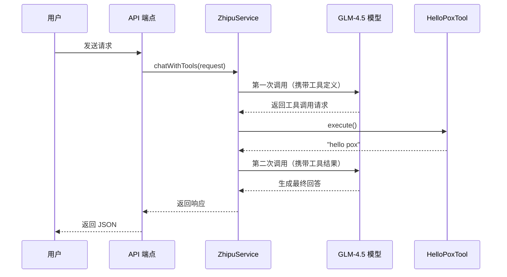

# 工具调用（Function Calling）功能说明

## ✨ 功能简介

实现了 AI 主动调用后端工具的能力，让 AI 可以：
- 🔍 获取实时信息
- 🧮 执行复杂计算
- 📊 查询数据库
- 🛠️ 执行特定操作

---

## 🚀 快速开始

### 1. 启动后端

```bash
cd back/piteAgents
./mvnw spring-boot:run
```

### 2. 测试工具调用

```bash
# 方式 1：使用测试脚本
./test-tool-calling.sh

# 方式 2：直接调用 API
curl -X POST http://localhost:8080/api/chat/with-tools \
  -H "Content-Type: application/json" \
  -d '{
    "messages": [
      {"role": "user", "content": "请调用 hello_pox 工具"}
    ],
    "model": "glm-4.5"
  }'
```

### 3. 查看结果

成功的响应示例：
```json
{
  "code": 200,
  "message": "success",
  "data": {
    "content": "成功调用了 hello_pox 工具！工具返回了问候信息：\"hello pox\"...",
    "finishReason": "stop",
    "usage": {
      "totalTokens": 186
    }
  }
}
```

---

## 📚 API 端点

| 端点 | 方法 | 功能 | 工具调用 |
|------|------|------|----------|
| `/api/chat` | POST | 普通对话 | ❌ |
| `/api/chat/stream` | POST | 流式对话 | ❌ |
| `/api/chat/with-tools` | POST | 工具调用对话 | ✅ |

---

## 🛠️ 已实现的工具

### hello_pox

**功能**: 返回问候语 "hello pox"

**触发条件**: 
- 用户明确要求调用 hello_pox
- 用户请求获取问候语
- 用户要求执行 hello_pox 函数

**参数**: 无

**返回**: 字符串 "hello pox"

---

## 💡 工作原理



---

## 🔧 代码结构

```
src/main/java/pox/com/piteagents/
├── controller/
│   └── ChatController.java           [新增] chatWithTools() 端点
├── service/
│   ├── IZhipuService.java            [新增] chatWithTools() 接口
│   ├── HelloPoxToolService.java      [新建] 简单工具实现
│   └── impl/
│       └── ZhipuServiceImpl.java     [新增] chatWithTools() 实现
```

---

## 📊 测试用例总结

| # | 输入 | AI 是否调用工具 | 结果 |
|---|------|----------------|------|
| 1 | "请调用 hello_pox 工具" | ✅ 是 | ✅ 成功 |
| 2 | "给我一个问候语" | ✅ 是 | ✅ 成功 |
| 3 | "什么是 Java？" | ❌ 否 | ✅ 成功 |
| 4 | "帮我执行 hello_pox 函数" | ✅ 是 | ✅ 成功 |

**结论**: AI 能够智能判断何时需要调用工具 ✅

---

## 🎯 下一步计划

### Phase 1: 模块化重构（推荐）

- [ ] 创建 `Tool` 接口（统一工具规范）
- [ ] 实现 `ToolRegistry`（工具注册和管理）
- [ ] 实现 `ToolExecutor`（通用工具执行引擎）
- [ ] 从数据库加载工具定义

### Phase 2: 实用工具开发

- [ ] 天气查询工具（调用天气 API）
- [ ] 计算器工具（复杂数学计算）
- [ ] 时间查询工具（返回当前时间）
- [ ] 数据库查询工具（查询业务数据）

### Phase 3: 管理功能

- [ ] 工具管理 CRUD API
- [ ] 前端工具管理界面
- [ ] 工具调用统计和监控

---

## ⚠️ 注意事项

1. **Token 消耗**: 工具调用需要两次 API 请求，会消耗更多 Token
2. **模型支持**: 仅 GLM-4.5/4.6 等模型支持工具调用
3. **当前限制**: 工具定义是硬编码的，需要后续改为动态加载
4. **安全性**: 后续需要添加工具执行权限控制

---

## 📖 相关文档

- [智谱 AI 官方文档 - Function Calling](https://docs.bigmodel.cn/cn/guide/models/text/glm-4.5#function-calling)
- [完整测试报告](./TOOL_CALLING_TEST.md)
- [项目架构文档](../../docs/architecture-design.md)

---

**创建时间**: 2025-10-25  
**版本**: 1.0.0 POC  
**状态**: ✅ 测试通过，功能正常


