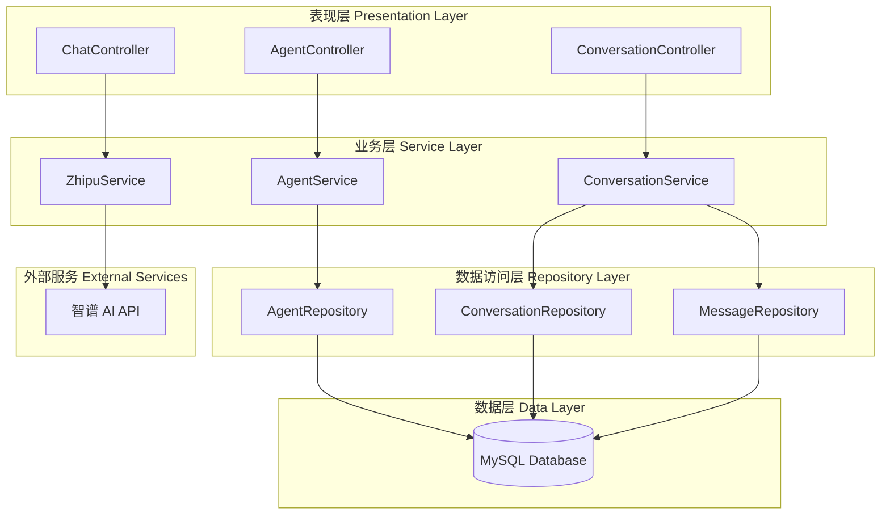
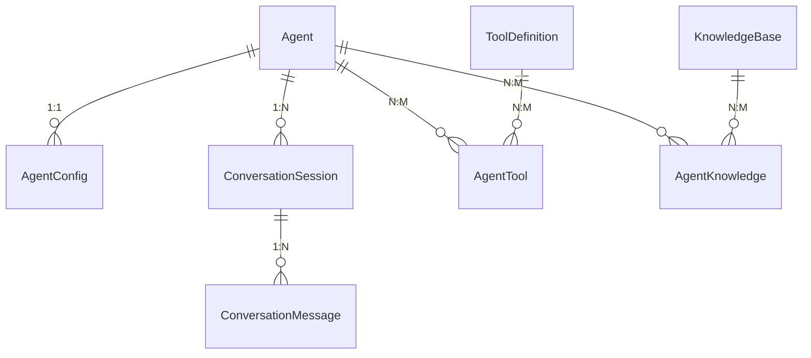
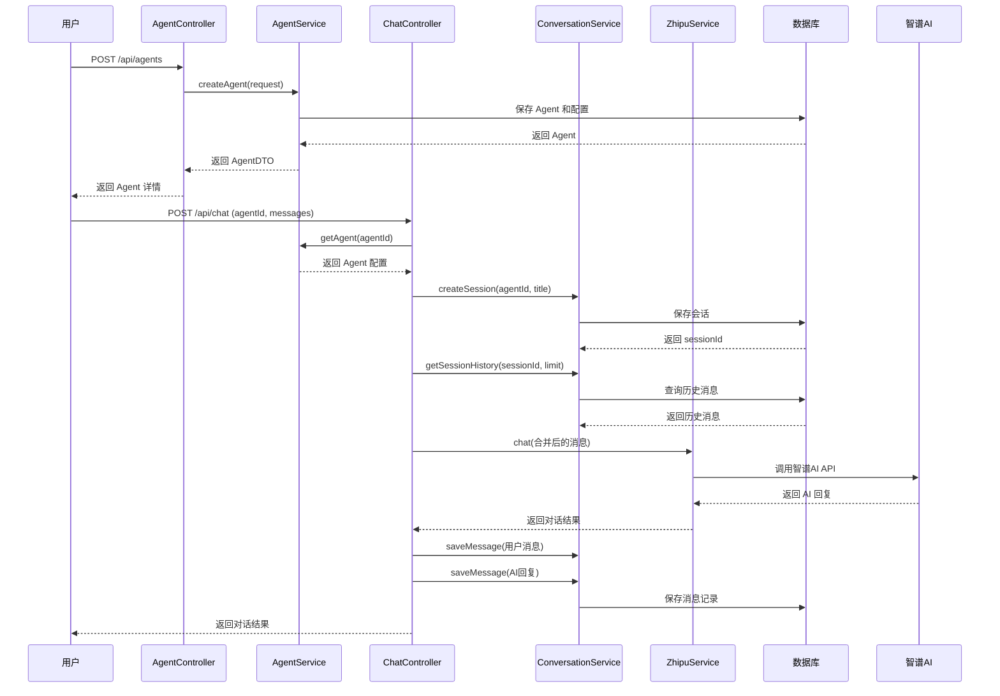
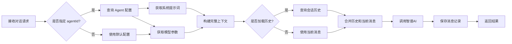

# piteAgents 系统架构设计文档

## 1. 系统概述

piteAgents 是一个完整的 AI Agent 管理系统，基于智谱 AI 开发，提供 Agent 创建、配置、对话历史管理等核心功能。

### 1.1 技术栈

- **后端框架**: Spring Boot 3.5.6
- **数据库**: MySQL 8.0+
- **ORM**: Spring Data JPA + Hibernate
- **数据库迁移**: Flyway
- **AI SDK**: 智谱 AI SDK 0.0.6
- **Java 版本**: Java 17

### 1.2 核心功能

1. **Agent 管理**: 创建、编辑、删除、查询 Agent
2. **提示词管理**: 系统提示词和角色提示词配置
3. **参数配置**: 模型选择、温度、Token 等参数
4. **对话历史**: 会话管理和消息记录
5. **工具管理**: 外部工具集成（待实现）
6. **知识库**: 知识库关联和检索（待实现）

## 2. 系统架构

### 2.1 分层架构



### 2.2 核心模块关系



## 3. 数据库设计

### 3.1 核心表结构

| 表名 | 用途 | 状态 |
|------|------|------|
| agent | Agent 基础信息 | ✅ 已实现 |
| agent_config | Agent 参数配置 | ✅ 已实现 |
| conversation_session | 对话会话 | ✅ 已实现 |
| conversation_message | 消息记录 | ✅ 已实现 |
| tool_definition | 工具定义 | ✅ 已实现 |
| agent_tool | Agent-工具关联 | ✅ 已实现 |
| knowledge_base | 知识库 | ✅ 已实现 |
| agent_knowledge | Agent-知识库关联 | ✅ 已实现 |

详细设计参见：[数据库设计文档](./database-design.md)

### 3.2 数据迁移

使用 Flyway 管理数据库版本：

```
src/main/resources/db/migration/
├── V1.0.0__init_agent_tables.sql          ✅ 已创建
├── V1.0.1__init_conversation_tables.sql   ✅ 已创建
├── V1.0.2__init_tool_tables.sql           ✅ 已创建
├── V1.0.3__init_knowledge_tables.sql      ✅ 已创建
└── V1.0.4__insert_sample_data.sql         ✅ 已创建
```

## 4. API 设计

### 4.1 Agent 管理接口

| 接口 | 方法 | 描述 | 状态 |
|------|------|------|------|
| /api/agents | POST | 创建 Agent | ✅ 已实现 |
| /api/agents | GET | 查询 Agent 列表 | ✅ 已实现 |
| /api/agents/{id} | GET | 获取 Agent 详情 | ✅ 已实现 |
| /api/agents/{id} | PUT | 更新 Agent | ✅ 已实现 |
| /api/agents/{id} | DELETE | 删除 Agent | ✅ 已实现 |
| /api/agents/{id}/config | PUT | 更新 Agent 配置 | ✅ 已实现 |
| /api/agents/{id}/status | PUT | 更新 Agent 状态 | ✅ 已实现 |

### 4.2 对话历史接口

| 接口 | 方法 | 描述 | 状态 |
|------|------|------|------|
| /api/sessions | GET | 获取会话列表 | ✅ 已实现 |
| /api/sessions/{id} | GET | 获取会话详情 | ✅ 已实现 |
| /api/sessions/{id}/messages | GET | 获取会话消息 | ✅ 已实现 |
| /api/sessions/{id} | DELETE | 删除会话 | ✅ 已实现 |
| /api/sessions/{id}/title | PUT | 更新会话标题 | ✅ 已实现 |

### 4.3 对话接口（待集成）

| 接口 | 方法 | 描述 | 状态 |
|------|------|------|------|
| /api/chat | POST | 使用 Agent 对话 | 🚧 待实现 |
| /api/chat/stream | POST | 使用 Agent 流式对话 | 🚧 待实现 |

详细设计参见：[API 设计文档](./api-design.md)

## 5. 类设计

### 5.1 实体类 (Entity)

```
pox.com.piteagents.entity/
├── Agent.java                    ✅ 已实现
├── AgentConfig.java              ✅ 已实现
├── ConversationSession.java      ✅ 已实现
├── ConversationMessage.java      ✅ 已实现
├── ToolDefinition.java           ✅ 已实现
├── AgentTool.java                ✅ 已实现
├── KnowledgeBase.java            ✅ 已实现
└── AgentKnowledge.java           ✅ 已实现
```

### 5.2 数据传输对象 (DTO)

```
pox.com.piteagents.dto/
├── AgentDTO.java                 ✅ 已实现
├── AgentConfigDTO.java           ✅ 已实现
├── AgentCreateRequest.java       ✅ 已实现
├── AgentUpdateRequest.java       ✅ 已实现
├── ConversationSessionDTO.java   ✅ 已实现
├── ConversationMessageDTO.java   ✅ 已实现
├── AgentChatRequest.java         ✅ 已实现
└── AgentChatResponse.java        ✅ 已实现
```

### 5.3 Repository 层

```
pox.com.piteagents.mapper/
├── AgentRepository.java              ✅ 已实现
├── AgentConfigRepository.java        ✅ 已实现
├── ConversationSessionRepository.java✅ 已实现
├── ConversationMessageRepository.java✅ 已实现
├── ToolDefinitionRepository.java     ✅ 已实现
├── AgentToolRepository.java          ✅ 已实现
├── KnowledgeBaseRepository.java      ✅ 已实现
└── AgentKnowledgeRepository.java     ✅ 已实现
```

### 5.4 Service 层

```
pox.com.piteagents.service/
├── AgentService.java             ✅ 已实现
├── ConversationService.java      ✅ 已实现
├── ZhipuService.java             ✅ 已存在（需集成）
├── ToolService.java              🚧 待实现
└── KnowledgeService.java         🚧 待实现
```

### 5.5 Controller 层

```
pox.com.piteagents.controller/
├── AgentController.java          ✅ 已实现
├── ConversationController.java   ✅ 已实现
├── ChatController.java           ✅ 已存在（需集成）
├── ToolController.java           🚧 待实现
└── KnowledgeController.java      🚧 待实现
```

## 6. 业务流程

### 6.1 创建 Agent 并进行对话



### 6.2 Agent 配置加载流程



## 7. 配置说明

### 7.1 application.yml

```yaml
spring:
  datasource:
    url: jdbc:mysql://localhost:3306/pite_agents
    username: root
    password: root@1234
  jpa:
    hibernate:
      ddl-auto: validate
    show-sql: true
  flyway:
    enabled: true
    baseline-on-migrate: true

zhipu:
  api-key: your-api-key
  default-model: glm-4.6
  default-temperature: 0.7
  max-tokens: 2000
```

### 7.2 数据库连接

- **地址**: localhost:3306
- **数据库名**: pite_agents
- **用户名**: root
- **密码**: root@1234

## 8. 后续开发计划

### 8.1 优先级 P0（核心功能）

- [ ] 集成 Agent 到现有的 ChatController
  - 修改 ChatController，支持使用 Agent ID 进行对话
  - 自动加载 Agent 配置和提示词
  - 自动保存对话历史
- [ ] 编写集成测试
  - Agent CRUD 测试
  - 对话历史测试
  - 完整对话流程测试

### 8.2 优先级 P1（进阶功能）

- [ ] 工具管理功能
  - 实现 ToolService
  - 实现 ToolController
  - 工具调用集成
- [ ] 知识库管理功能
  - 实现 KnowledgeService
  - 实现 KnowledgeController
  - 知识库检索集成

### 8.3 优先级 P2（优化功能）

- [ ] API 文档集成（SpringDoc OpenAPI）
- [ ] 性能优化（缓存、索引）
- [ ] 日志完善
- [ ] 监控和指标

## 9. 测试策略

### 9.1 单元测试

为每个 Service 和 Controller 编写单元测试：

```
src/test/java/pox/com/piteagents/
├── service/
│   ├── AgentServiceTest.java        🚧 待实现
│   └── ConversationServiceTest.java 🚧 待实现
└── controller/
    ├── AgentControllerTest.java     🚧 待实现
    └── ConversationControllerTest.java 🚧 待实现
```

### 9.2 集成测试

测试完整的业务流程：

```java
@SpringBootTest
@AutoConfigureMockMvc
class AgentIntegrationTest {
    // 测试创建 Agent -> 配置 -> 对话 -> 查询历史的完整流程
}
```

## 10. 部署指南

### 10.1 本地开发

1. 启动 MySQL 数据库
2. 创建数据库 `pite_agents`
3. 配置 `application.yml` 中的数据库连接
4. 运行 Spring Boot 应用
5. Flyway 会自动执行数据库迁移

### 10.2 启动命令

```bash
# 使用 Maven 启动
cd back/piteAgents
./mvnw spring-boot:run

# 或使用 IDEA 直接运行 PiteAgentsApplication
```

### 10.3 验证

启动后访问：
- API 基础路径: http://localhost:8080/api
- 健康检查: http://localhost:8080/api/agents

## 11. 故障排查

### 11.1 常见问题

**数据库连接失败**
- 检查 MySQL 是否启动
- 检查数据库连接配置
- 检查防火墙设置

**Flyway 迁移失败**
- 检查迁移脚本语法
- 检查数据库权限
- 使用 `flyway.baseline-on-migrate=true` 处理已有数据库

**JPA 懒加载问题**
- 使用 `@Transactional` 注解
- 配置 `spring.jpa.open-in-view=false`
- 在 Service 层完成数据加载

## 12. 参考文档

- [数据库设计文档](./database-design.md)
- [API 设计文档](./api-design.md)
- [Spring Boot 官方文档](https://spring.io/projects/spring-boot)
- [Spring Data JPA 文档](https://spring.io/projects/spring-data-jpa)
- [Flyway 文档](https://flywaydb.org/documentation/)
- [智谱 AI 文档](https://docs.bigmodel.cn/)

---

**文档版本**: 1.0.0  
**最后更新**: 2025-10-24  
**维护者**: piteAgents Team

