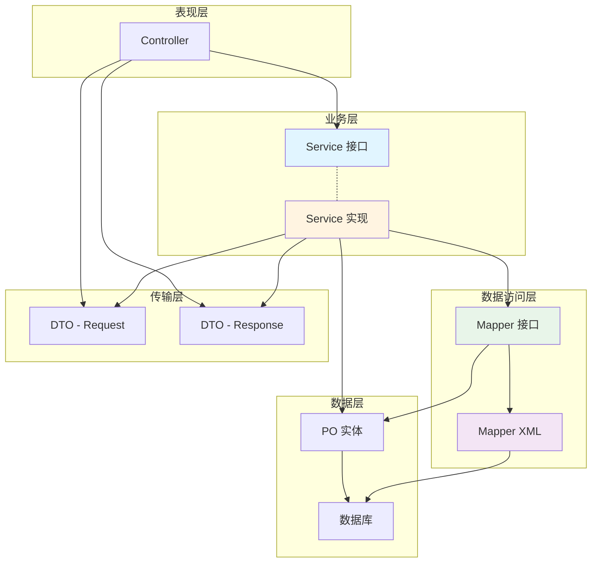

# 优化后的包结构说明文档

## 📦 最终包结构

```
pox.com.piteagents/
├── config/                         # 配置类包（2个类）
│   ├── CorsConfig.java             ✅ CORS 跨域配置
│   └── ZhipuConfig.java            ✅ 智谱 AI 配置
│
├── constant/                       # 常量类包（5个类）
│   ├── AgentConstants.java         ✅ Agent 相关常量
│   ├── ApiConstants.java           ✅ API 相关常量
│   ├── ConversationConstants.java  ✅ 对话相关常量
│   ├── FinishReason.java           ✅ 完成原因常量
│   └── MessageRole.java            ✅ 消息角色常量
│
├── controller/                     # 控制器层（3个类）
│   ├── AgentController.java        ✅ Agent 管理接口
│   ├── ChatController.java         ✅ 对话接口
│   └── ConversationController.java ✅ 对话历史接口
│
├── entity/                         # 实体包
│   ├── dto/                        # 数据传输对象
│   │   ├── common/                 # 通用 DTO
│   │   │   ├── ApiResponse.java    ✅ 统一响应格式
│   │   │   └── Message.java        ✅ 消息对象
│   │   ├── request/                # 请求对象
│   │   │   ├── AgentCreateRequest.java    ✅ 创建 Agent
│   │   │   ├── AgentUpdateRequest.java    ✅ 更新 Agent
│   │   │   ├── AgentChatRequest.java      ✅ Agent 对话
│   │   │   └── ChatRequest.java           ✅ 对话请求
│   │   └── response/               # 响应对象
│   │       ├── AgentDTO.java              ✅ Agent 详情
│   │       ├── AgentConfigDTO.java        ✅ Agent 配置
│   │       ├── AgentChatResponse.java     ✅ Agent 对话响应
│   │       ├── ChatResponse.java          ✅ 对话响应
│   │       ├── ConversationSessionDTO.java ✅ 会话详情
│   │       ├── ConversationMessageDTO.java ✅ 消息详情
│   │       ├── StreamChatResponse.java    ✅ 流式响应
│   │       └── ModelInfoResponse.java     ✅ 模型信息
│   ├── po/                         # 持久化对象（数据库实体）
│   │   ├── base/                   # 基础实体
│   │   │   ├── BaseEntity.java     ✅ 基础实体（ID + 审计字段）
│   │   │   └── SoftDeleteEntity.java ✅ 软删除实体
│   │   ├── AgentPO.java            ✅ Agent 实体
│   │   ├── AgentConfigPO.java      ✅ Agent 配置
│   │   ├── AgentToolPO.java        ✅ Agent-工具关联
│   │   ├── AgentKnowledgePO.java   ✅ Agent-知识库关联
│   │   ├── ConversationSessionPO.java ✅ 会话实体
│   │   ├── ConversationMessagePO.java ✅ 消息实体
│   │   ├── ToolDefinitionPO.java   ✅ 工具定义
│   │   └── KnowledgeBasePO.java    ✅ 知识库
│   └── vo/                         # 视图对象（预留，用于复杂查询结果）
│
├── enums/                          # 枚举类包（5个类）
│   ├── AgentStatusEnum.java        ✅ Agent 状态枚举
│   ├── ChatModeEnum.java           ✅ 对话模式枚举
│   ├── ContentTypeEnum.java        ✅ 内容类型枚举
│   ├── HttpMethodEnum.java         ✅ HTTP 方法枚举
│   └── ZhipuModelEnum.java         ✅ 智谱模型枚举
│
├── exception/                      # 异常类包（2个类）
│   ├── GlobalExceptionHandler.java ✅ 全局异常处理
│   └── ZhipuApiException.java      ✅ 智谱 API 异常
│
├── mapper/                         # Mapper 接口包（8个接口）
│   ├── AgentMapper.java            ✅ Agent 数据访问
│   ├── AgentConfigMapper.java      ✅ Agent 配置数据访问
│   ├── AgentToolMapper.java        ✅ Agent-工具关联
│   ├── AgentKnowledgeMapper.java   ✅ Agent-知识库关联
│   ├── ConversationSessionMapper.java ✅ 会话数据访问
│   ├── ConversationMessageMapper.java ✅ 消息数据访问
│   ├── ToolDefinitionMapper.java   ✅ 工具定义数据访问
│   └── KnowledgeBaseMapper.java    ✅ 知识库数据访问
│
├── service/                        # 服务层包
│   ├── impl/                       # 服务实现类
│   │   ├── AgentServiceImpl.java   ✅ Agent 服务实现
│   │   ├── ConversationServiceImpl.java ✅ 对话服务实现
│   │   └── ZhipuServiceImpl.java   ✅ 智谱 AI 服务实现
│   ├── IAgentService.java          ✅ Agent 服务接口
│   ├── IConversationService.java   ✅ 对话服务接口
│   └── IZhipuService.java          ✅ 智谱 AI 服务接口
│
└── PiteAgentsApplication.java      ✅ 应用启动类
```

## 📁 Resources 资源目录

```
src/main/resources/
├── application.yml                 ✅ 应用配置文件
├── db/
│   └── migration/                  # Flyway 数据库迁移脚本
│       ├── V1.0.0__init_agent_tables.sql
│       ├── V1.0.1__init_conversation_tables.sql
│       ├── V1.0.2__init_tool_tables.sql
│       ├── V1.0.3__init_knowledge_tables.sql
│       └── V1.0.4__insert_sample_data.sql
├── mapper/                         # MyBatis Mapper XML 文件
│   ├── AgentMapper.xml             ✅ Agent 查询映射
│   ├── AgentConfigMapper.xml       ✅ Agent 配置映射
│   ├── ConversationSessionMapper.xml ✅ 会话映射
│   ├── ConversationMessageMapper.xml ✅ 消息映射
│   ├── ToolDefinitionMapper.xml    ✅ 工具定义映射
│   └── KnowledgeBaseMapper.xml     ✅ 知识库映射
└── static/                         # 静态资源（如果需要）
```

## 🎯 核心设计理念

### 1. PO-DTO 分离

**PO (Persistent Object)** - `entity/po/`
- 数据库实体对象
- 与数据库表一一对应
- 包含 JPA/MyBatis 注解
- 不暴露给外部

**DTO (Data Transfer Object)** - `entity/dto/`
- 数据传输对象
- 用于不同层之间传输数据
- 不包含持久化注解
- 可以暴露给外部

**优势**：
- ✅ 数据库表结构变化不影响 API 接口
- ✅ 可以隐藏敏感字段
- ✅ 减少网络传输数据量
- ✅ 符合单一职责原则

### 2. 接口-实现分离

**接口** - `service/IXxxService.java`
- 定义业务契约
- 便于单元测试（Mock）
- 支持多种实现
- 面向接口编程

**实现** - `service/impl/XxxServiceImpl.java`
- 具体业务逻辑
- 可以有多个实现类
- 便于切换实现

**优势**：
- ✅ 降低耦合度
- ✅ 提高可测试性
- ✅ 便于扩展
- ✅ 符合依赖倒置原则

### 3. Mapper (JPA + MyBatis)

当前使用 JPA，但保留了 Mapper 命名和 XML 配置：

**Mapper 接口** - `mapper/XxxMapper.java`
- 数据访问接口
- 目前继承 JpaRepository
- 未来可以迁移到 MyBatis-Plus

**Mapper XML** - `resources/mapper/XxxMapper.xml`
- 复杂 SQL 查询
- 动态 SQL 支持
- 结果映射配置
- 预留用于 MyBatis

**优势**：
- ✅ 为将来迁移到 MyBatis-Plus 做准备
- ✅ 复杂查询可以使用 XML 配置
- ✅ SQL 和代码分离

## 🔄 依赖关系图



## 📐 包命名规范

### 按职责分包（✅ 当前采用）

```
pox.com.piteagents/
├── controller/      # 按职责：控制器
├── service/         # 按职责：业务逻辑
├── mapper/          # 按职责：数据访问
├── entity/          # 按职责：实体和DTO
│   ├── po/          # 持久化对象
│   └── dto/         # 数据传输对象
└── ...
```

**优势**：
- ✅ 职责清晰，便于理解
- ✅ 符合主流分层架构
- ✅ 便于新人快速上手

### 按模块分包（备选方案）

```
pox.com.piteagents/
├── agent/           # Agent 模块
│   ├── controller/
│   ├── service/
│   ├── mapper/
│   └── entity/
├── conversation/    # 对话模块
│   ├── controller/
│   ├── service/
│   ├── mapper/
│   └── entity/
└── ...
```

**适用场景**：
- 大型项目，模块众多
- 多团队并行开发
- 微服务架构准备

## 🏆 符合大厂规范的特点

### 1. 阿里巴巴规范

- ✅ PO/DTO/VO 分离
- ✅ Service 接口和实现分离
- ✅ Mapper 命名（数据访问层）
- ✅ 常量类使用 final 修饰
- ✅ 私有构造函数防止实例化

### 2. 腾讯/字节规范

- ✅ 清晰的分层架构
- ✅ 统一的异常处理
- ✅ 完善的日志记录
- ✅ 代码注释完整

### 3. 美团/京东规范

- ✅ BaseEntity 基类抽象
- ✅ 软删除支持
- ✅ 审计字段统一管理
- ✅ 复杂查询使用 XML 配置

## 📊 类命名对照表

### Entity 命名规范

| 类型 | 后缀 | 示例 | 说明 |
|------|------|------|------|
| 持久化对象 | PO | AgentPO | Persistent Object，数据库实体 |
| 数据传输对象 | DTO | AgentDTO | Data Transfer Object |
| 值对象 | VO | AgentVO | Value Object，只读数据 |
| 查询对象 | Query | AgentQuery | 封装查询条件 |
| 请求对象 | Request | AgentCreateRequest | 接收请求参数 |
| 响应对象 | Response | AgentResponse | 返回响应数据 |

### Service 命名规范

| 类型 | 前缀 | 后缀 | 示例 |
|------|------|------|------|
| 服务接口 | I | Service | IAgentService |
| 服务实现 | - | ServiceImpl | AgentServiceImpl |

### Mapper 命名规范

| 类型 | 后缀 | 示例 |
|------|------|------|
| Mapper 接口 | Mapper | AgentMapper |
| Mapper XML | Mapper.xml | AgentMapper.xml |

## 🔧 配置说明

### MyBatis 配置（预留）

在 `application.yml` 中添加（如果需要使用 MyBatis-Plus）：

```yaml
mybatis-plus:
  # Mapper XML 文件路径
  mapper-locations: classpath*:mapper/**/*.xml
  # 实体类路径
  type-aliases-package: pox.com.piteagents.entity.po
  # 全局配置
  global-config:
    db-config:
      # 主键类型（自增）
      id-type: auto
      # 逻辑删除字段
      logic-delete-field: deletedAt
      logic-delete-value: NOW()
      logic-not-delete-value: NULL
  # 配置打印 SQL
  configuration:
    log-impl: org.apache.ibatis.logging.stdout.StdOutImpl
```

### JPA 配置（当前使用）

```yaml
spring:
  jpa:
    hibernate:
      ddl-auto: validate
    show-sql: true
    properties:
      hibernate:
        dialect: org.hibernate.dialect.MySQL8Dialect
        format_sql: true
```

## 📝 Mapper XML 使用示例

### 简单查询（JPA 自动实现）

```java
// Mapper 接口
Optional<AgentPO> findById(Long id);
```

### 复杂查询（使用 XML 配置）

```xml
<!-- AgentMapper.xml -->
<select id="selectAgentWithConfig" resultMap="AgentWithConfigMap">
    SELECT a.*, ac.*
    FROM agent a
    LEFT JOIN agent_config ac ON a.id = ac.agent_id
    WHERE a.id = #{id} AND a.deleted_at IS NULL
</select>
```

```java
// Mapper 接口
AgentPO selectAgentWithConfig(Long id);
```

### 动态 SQL 查询

```xml
<!-- 复杂搜索 -->
<select id="complexSearch" resultMap="BaseResultMap">
    SELECT * FROM agent
    <where>
        deleted_at IS NULL
        <if test="keyword != null">
            AND (name LIKE CONCAT('%', #{keyword}, '%')
            OR description LIKE CONCAT('%', #{keyword}, '%'))
        </if>
        <if test="category != null">
            AND category = #{category}
        </if>
    </where>
    ORDER BY created_at DESC
</select>
```

## 🎨 优化亮点

### 1. 三层对象模型

```
PO (数据库) → DTO (传输) → VO (展示)
```

- **PO**：与数据库表对应，包含所有字段
- **DTO**：用于层间传输，只包含必要字段
- **VO**：用于前端展示，可能包含计算字段

### 2. Service 层最佳实践

```java
// 接口定义契约
public interface IAgentService {
    AgentDTO createAgent(AgentCreateRequest request);
}

// 实现类提供具体逻辑
@Service
public class AgentServiceImpl implements IAgentService {
    @Override
    public AgentDTO createAgent(AgentCreateRequest request) {
        // 实现
    }
}

// Controller 依赖接口
@RestController
public class AgentController {
    private final IAgentService agentService;  // 依赖接口
}
```

### 3. Mapper 层灵活配置

```java
// JPA 方式（简单查询）
@Repository
public interface AgentMapper extends JpaRepository<AgentPO, Long> {
    Optional<AgentPO> findByName(String name);
}

// MyBatis 方式（复杂查询）
@Repository
public interface AgentMapper {
    @Select("SELECT * FROM agent WHERE id = #{id}")
    AgentPO selectById(Long id);
}

// MyBatis XML 方式（动态 SQL）
<select id="complexSearch">
    ...动态 SQL...
</select>
```

## 📖 迁移指南

### 从 JPA 迁移到 MyBatis-Plus

**步骤 1**：添加 MyBatis-Plus 依赖

```xml
<dependency>
    <groupId>com.baomidou</groupId>
    <artifactId>mybatis-plus-boot-starter</artifactId>
    <version>3.5.5</version>
</dependency>
```

**步骤 2**：Mapper 接口改为继承 BaseMapper

```java
// 从
public interface AgentMapper extends JpaRepository<AgentPO, Long> {
}

// 改为
public interface AgentMapper extends BaseMapper<AgentPO> {
}
```

**步骤 3**：使用 MyBatis-Plus 注解

```java
@TableName("agent")
public class AgentPO {
    @TableId(type = IdType.AUTO)
    private Long id;
    
    @TableField("name")
    private String name;
    
    @TableLogic
    private LocalDateTime deletedAt;
}
```

**步骤 4**：移除 JPA 依赖

```xml
<!-- 移除 -->
<dependency>
    <groupId>org.springframework.boot</groupId>
    <artifactId>spring-boot-starter-data-jpa</artifactId>
</dependency>
```

## 🔍 当前技术栈说明

### 数据访问层

**当前使用**：Spring Data JPA + Hibernate

**为什么保留 Mapper 命名**：
1. 统一术语，Mapper 在 MyBatis 和 JPA 都适用
2. 为将来可能的 MyBatis 迁移做准备
3. 在大厂中，Mapper 是数据访问层的通用命名

**为什么创建 Mapper.xml**：
1. 为复杂查询提供支持（即使用 JPA，也可能需要原生 SQL）
2. 为将来迁移到 MyBatis-Plus 做准备
3. XML 配置便于维护复杂的 SQL 逻辑

## 📚 参考文档

- [阿里巴巴 Java 开发手册 - 工程规约](https://github.com/alibaba/p3c)
- [MyBatis-Plus 官方文档](https://baomidou.com/)
- [Spring Data JPA 文档](https://spring.io/projects/spring-data-jpa)

---

**包结构已优化完成，符合大厂开发规范！** ⭐⭐⭐⭐⭐

