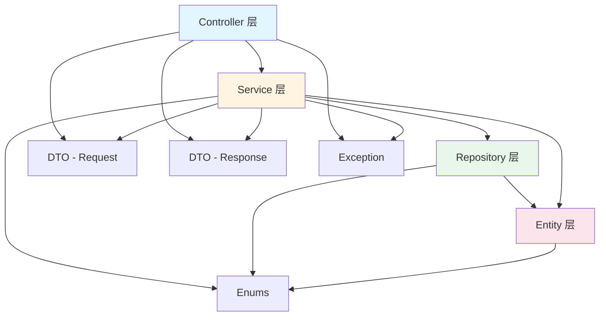

# piteAgents 包结构说明文档

## 1. 整体包结构

```
pox.com.piteagents/
├── config/                         # 配置类包
├── constant/                       # 常量类包
├── controller/                     # 控制器包（表现层）
├── dto/                            # 数据传输对象包
│   ├── common/                     # 通用 DTO
│   ├── request/                    # 请求对象
│   └── response/                   # 响应对象
├── entity/                         # 实体类包（数据层）
│   └── base/                       # 基础实体类
├── enums/                          # 枚举类包
├── exception/                      # 异常类包
├── repository/                     # 数据访问层包
├── service/                        # 业务逻辑层包
└── PiteAgentsApplication.java      # 应用启动类
```

## 2. 详细包说明

### 2.1 config/ - 配置类包

**用途**：存放所有配置类，使用 @Configuration 注解

**文件清单**：

| 文件名 | 说明 | 关键注解 |
|--------|------|----------|
| CorsConfig.java | CORS 跨域配置 | @Configuration, @Bean |
| ZhipuConfig.java | 智谱 AI 配置 | @Configuration, @ConfigurationProperties |

**规范**：
- 类名以 `Config` 结尾
- 使用 @Configuration 标注
- Bean 定义使用 @Bean 注解
- 配置属性使用 @ConfigurationProperties

---

### 2.2 constant/ - 常量类包

**用途**：存放所有常量定义，避免魔法数字和字符串

**文件清单**：

| 文件名 | 说明 | 类型 |
|--------|------|------|
| AgentConstants.java | Agent 相关常量 | final class |
| ApiConstants.java | API 相关常量 | final class |
| ConversationConstants.java | 对话相关常量 | final class |
| FinishReason.java | 完成原因常量 | final class |
| MessageRole.java | 消息角色常量 | final class |

**规范**：
- 类使用 `final` 修饰，不可继承
- 私有构造函数，抛出 UnsupportedOperationException
- 常量使用 `public static final`
- 常量名全大写下划线

**示例**：
```java
public final class XxxConstants {
    public static final String DEFAULT_VALUE = "xxx";
    
    private XxxConstants() {
        throw new UnsupportedOperationException("...");
    }
}
```

---

### 2.3 controller/ - 控制器包

**用途**：REST API 接口定义，处理 HTTP 请求

**文件清单**：

| 文件名 | 路径 | 说明 |
|--------|------|------|
| AgentController.java | /api/agents | Agent 管理接口 |
| ChatController.java | /api/chat | 对话接口 |
| ConversationController.java | /api/sessions | 对话历史接口 |

**规范**：
- 类名以 `Controller` 结尾
- 使用 @RestController 标注
- 使用 @RequestMapping 定义基础路径
- 方法使用 @GetMapping / @PostMapping 等
- 返回统一的 ApiResponse 格式
- 使用 @Valid 进行参数验证
- 不包含业务逻辑，只负责参数校验和调用 Service

**职责**：
- ✅ 接收和验证请求参数
- ✅ 调用 Service 层方法
- ✅ 返回标准化响应
- ❌ 不直接操作数据库
- ❌ 不包含复杂业务逻辑

---

### 2.4 dto/ - 数据传输对象包

**用途**：在不同层之间传输数据，解耦实体类和外部接口

#### 2.4.1 dto/common/ - 通用 DTO

**文件清单**：

| 文件名 | 说明 |
|--------|------|
| ApiResponse.java | 统一 API 响应格式 |

**用途**：
- 跨模块共享的 DTO
- 通用的数据结构
- 工具类 DTO

#### 2.4.2 dto/request/ - 请求对象包

**文件清单**：

| 文件名 | 说明 |
|--------|------|
| AgentCreateRequest.java | 创建 Agent 请求 |
| AgentUpdateRequest.java | 更新 Agent 请求 |
| AgentChatRequest.java | Agent 对话请求 |
| ChatRequest.java | 对话请求 |

**规范**：
- 类名以 `Request` 或 `Param` 结尾
- 包含参数验证注解（@NotNull, @NotBlank, @Size）
- 只包含接收参数所需的字段
- 使用 Lombok @Data, @Builder

**示例**：
```java
@Data
@Builder
@NoArgsConstructor
@AllArgsConstructor
public class XxxCreateRequest {
    @NotBlank(message = "名称不能为空")
    private String name;
}
```

#### 2.4.3 dto/response/ - 响应对象包

**文件清单**：

| 文件名 | 说明 |
|--------|------|
| AgentDTO.java | Agent 响应对象 |
| AgentConfigDTO.java | Agent 配置响应 |
| AgentChatResponse.java | Agent 对话响应 |
| ChatResponse.java | 对话响应 |
| ConversationSessionDTO.java | 会话响应 |
| ConversationMessageDTO.java | 消息响应 |
| StreamChatResponse.java | 流式对话响应 |
| ModelInfo.java | 模型信息响应 |

**规范**：
- 类名以 `DTO`、`Response` 或 `VO` 结尾
- 包含展示所需的所有字段
- 可以包含关联对象的信息
- 不包含验证注解

**示例**：
```java
@Data
@Builder
@NoArgsConstructor
@AllArgsConstructor
public class XxxDTO {
    private Long id;
    private String name;
    private LocalDateTime createdAt;
}
```

#### 2.4.4 dto/ - 通用数据对象

**文件清单**：

| 文件名 | 说明 |
|--------|------|
| Message.java | 消息对象（通用） |

**用途**：
- 既用于请求也用于响应的对象
- 领域模型对象
- 值对象（Value Object）

---

### 2.5 entity/ - 实体类包

**用途**：数据库表映射，使用 JPA 注解

#### 2.5.1 entity/base/ - 基础实体类

**文件清单**：

| 文件名 | 说明 |
|--------|------|
| BaseEntity.java | 基础实体（ID、时间戳） |
| SoftDeleteEntity.java | 支持软删除的实体 |

**用途**：
- 提取公共字段（id, createdAt, updatedAt）
- 统一审计字段管理
- 减少重复代码

**使用方式**：
```java
@Entity
@Table(name = "xxx")
public class Xxx extends BaseEntity {
    // 只需定义业务字段
}

// 需要软删除的实体
@Entity
@Table(name = "yyy")
@SQLDelete(sql = "UPDATE yyy SET deleted_at = NOW() WHERE id = ?")
@Where(clause = "deleted_at IS NULL")
public class Yyy extends SoftDeleteEntity {
    // 自动拥有 deletedAt 字段
}
```

#### 2.5.2 entity/ - 业务实体类

**文件清单**：

| 文件名 | 表名 | 说明 |
|--------|------|------|
| Agent.java | agent | Agent 基础信息 |
| AgentConfig.java | agent_config | Agent 配置 |
| AgentTool.java | agent_tool | Agent-工具关联 |
| AgentKnowledge.java | agent_knowledge | Agent-知识库关联 |
| ConversationSession.java | conversation_session | 会话 |
| ConversationMessage.java | conversation_message | 消息记录 |
| ToolDefinition.java | tool_definition | 工具定义 |
| KnowledgeBase.java | knowledge_base | 知识库 |

**规范**：
- 类名与表名对应（驼峰与下划线转换）
- 使用 @Entity 和 @Table 注解
- 继承 BaseEntity 或 SoftDeleteEntity
- 使用 Lombok @Data, @Builder
- 关联关系使用 JPA 注解（@OneToOne, @OneToMany 等）

---

### 2.6 enums/ - 枚举类包

**用途**：定义业务枚举类型，替代硬编码字符串

**文件清单**：

| 文件名 | 说明 | 枚举值 |
|--------|------|--------|
| AgentStatusEnum.java | Agent 状态 | ACTIVE, INACTIVE, ARCHIVED |
| ChatModeEnum.java | 对话模式 | SYNC, STREAM |
| ContentTypeEnum.java | 内容类型 | TEXT, MARKDOWN, JSON, HTML |
| HttpMethodEnum.java | HTTP 方法 | GET, POST, PUT, DELETE, PATCH |
| ZhipuModelEnum.java | 智谱模型 | GLM_4_5, GLM_4_6 |

**规范**：
- 类名以 `Enum` 结尾
- 枚举常量全大写下划线
- 包含 code 和 name 字段
- 提供 fromCode() 静态方法
- 提供 isValidCode() 验证方法

**示例**：
```java
@Getter
public enum XxxEnum {
    VALUE_ONE("VALUE_ONE", "值一"),
    VALUE_TWO("VALUE_TWO", "值二");
    
    private final String code;
    private final String name;
    
    XxxEnum(String code, String name) {
        this.code = code;
        this.name = name;
    }
    
    public static XxxEnum fromCode(String code) {
        // ...
    }
}
```

---

### 2.7 exception/ - 异常类包

**用途**：自定义异常类和全局异常处理

**文件清单**：

| 文件名 | 类型 | 说明 |
|--------|------|------|
| GlobalExceptionHandler.java | 处理器 | 全局异常处理 |
| ZhipuApiException.java | 异常类 | 智谱 API 异常 |

**规范**：
- 异常类以 `Exception` 结尾
- 继承自 RuntimeException（非受检异常）
- 包含错误码和错误消息
- 全局处理器使用 @RestControllerAdvice

**示例**：
```java
@Getter
public class BusinessException extends RuntimeException {
    private final Integer code;
    private final String message;
    
    public BusinessException(Integer code, String message) {
        super(message);
        this.code = code;
        this.message = message;
    }
}
```

---

### 2.8 repository/ - 数据访问层包

**用途**：数据库访问接口，继承 JpaRepository

**文件清单**：

| 文件名 | 实体类 | 说明 |
|--------|--------|------|
| AgentRepository.java | Agent | Agent 数据访问 |
| AgentConfigRepository.java | AgentConfig | Agent 配置数据访问 |
| AgentToolRepository.java | AgentTool | Agent-工具关联 |
| AgentKnowledgeRepository.java | AgentKnowledge | Agent-知识库关联 |
| ConversationSessionRepository.java | ConversationSession | 会话数据访问 |
| ConversationMessageRepository.java | ConversationMessage | 消息数据访问 |
| ToolDefinitionRepository.java | ToolDefinition | 工具定义数据访问 |
| KnowledgeBaseRepository.java | KnowledgeBase | 知识库数据访问 |

**规范**：
- 接口名为 `实体名 + Repository`
- 继承 `JpaRepository<Entity, ID>`
- 使用 @Repository 标注
- 查询方法遵循 Spring Data JPA 命名规范
- 复杂查询使用 @Query 注解

**Spring Data JPA 查询方法命名规范**：
```java
// 基础查询
findBy{Property}                    // 根据属性查询
findBy{Property}And{Property}       // 多条件查询
findBy{Property}OrderBy{Property}   // 排序查询

// 分页查询
findBy{Property}(Pageable pageable)

// 计数查询
countBy{Property}

// 存在性检查
existsBy{Property}

// 删除操作
deleteBy{Property}
```

---

### 2.9 service/ - 业务逻辑层包

**用途**：实现核心业务逻辑

**文件清单**：

| 文件名 | 说明 | 职责 |
|--------|------|------|
| AgentService.java | Agent 业务服务 | Agent CRUD、配置管理 |
| ConversationService.java | 对话服务 | 会话和消息管理 |
| ZhipuService.java | 智谱 AI 服务 | 调用智谱 AI SDK |

**规范**：
- 类名为 `业务名 + Service`
- 使用 @Service 标注
- 使用 @Transactional 管理事务
- 注入 Repository，不直接注入其他 Service（避免循环依赖）
- 公共方法为业务接口
- 私有方法为辅助逻辑（如 DTO 转换）

**分层调用规则**：
```
Controller -> Service -> Repository -> Database
         |            |
         |            -> 外部服务（如智谱 AI）
         |
         -> 不直接调用 Repository
```

---

## 3. 依赖关系图

### 3.1 分层依赖



### 3.2 模块依赖规则

**允许的依赖**：
- ✅ Controller -> Service
- ✅ Service -> Repository
- ✅ Service -> Entity
- ✅ Repository -> Entity
- ✅ 所有层 -> DTO
- ✅ 所有层 -> Enums
- ✅ 所有层 -> Constants
- ✅ 所有层 -> Exception

**禁止的依赖**：
- ❌ Controller -> Repository（跨层调用）
- ❌ Controller -> Entity（直接操作实体）
- ❌ Repository -> Service（反向依赖）
- ❌ DTO -> Entity（DTO 不应该知道实体）
- ❌ Entity -> DTO（实体不应该知道 DTO）

---

## 4. 文件组织最佳实践

### 4.1 单一职责原则

每个类只负责一个功能模块：
- AgentService 只负责 Agent 相关业务
- ConversationService 只负责对话相关业务
- 避免创建 "万能" 类

### 4.2 接口隔离原则

Repository 接口只定义必需的方法：
```java
// ✅ 好的设计
public interface AgentRepository extends JpaRepository<Agent, Long> {
    Optional<Agent> findByName(String name);
}

// ❌ 不好的设计 - 定义太多不使用的方法
public interface AgentRepository extends JpaRepository<Agent, Long> {
    // 100+ 个方法
}
```

### 4.3 依赖倒置原则

高层模块不应该依赖低层模块，都应该依赖抽象：
```java
// Service 依赖 Repository 接口，而不是具体实现
@Service
public class AgentService {
    private final AgentRepository agentRepository; // 接口
}
```

---

## 5. 代码组织示例

### 5.1 Controller 完整示例

```java
@Slf4j
@RestController
@RequestMapping("/api/agents")
@RequiredArgsConstructor
public class AgentController {
    
    // 1. 依赖注入
    private final AgentService agentService;
    
    // 2. 公共 API 方法（按 CRUD 顺序）
    
    @PostMapping
    public ApiResponse<AgentDTO> create(@Valid @RequestBody AgentCreateRequest request) {
        // 创建
    }
    
    @GetMapping
    public ApiResponse<Page<AgentDTO>> list(...) {
        // 查询列表
    }
    
    @GetMapping("/{id}")
    public ApiResponse<AgentDTO> get(@PathVariable Long id) {
        // 查询详情
    }
    
    @PutMapping("/{id}")
    public ApiResponse<AgentDTO> update(...) {
        // 更新
    }
    
    @DeleteMapping("/{id}")
    public ApiResponse<Void> delete(@PathVariable Long id) {
        // 删除
    }
    
    // 3. 内部类（如果需要）
    @Data
    public static class StatusRequest {
        private String status;
    }
}
```

### 5.2 Service 完整示例

```java
@Slf4j
@Service
@RequiredArgsConstructor
public class AgentService {
    
    // 1. 依赖注入
    private final AgentRepository agentRepository;
    private final AgentConfigRepository agentConfigRepository;
    
    // 2. 公共业务方法（按 CRUD 顺序）
    
    @Transactional(rollbackFor = Exception.class)
    public AgentDTO createAgent(AgentCreateRequest request) {
        // 创建逻辑
    }
    
    @Transactional(readOnly = true)
    public AgentDTO getAgent(Long id) {
        // 查询逻辑
    }
    
    @Transactional(rollbackFor = Exception.class)
    public AgentDTO updateAgent(Long id, AgentUpdateRequest request) {
        // 更新逻辑
    }
    
    @Transactional(rollbackFor = Exception.class)
    public void deleteAgent(Long id) {
        // 删除逻辑
    }
    
    // 3. 私有辅助方法
    
    private AgentDTO convertToDTO(Agent agent) {
        // 转换逻辑
    }
    
    private Agent convertToEntity(AgentCreateRequest request) {
        // 转换逻辑
    }
}
```

### 5.3 Repository 完整示例

```java
@Repository
public interface AgentRepository extends JpaRepository<Agent, Long> {
    
    // 1. 基础查询方法（按字段分组）
    
    // 名称相关
    Optional<Agent> findByName(String name);
    boolean existsByName(String name);
    
    // 分类相关
    Page<Agent> findByCategory(String category, Pageable pageable);
    long countByCategory(String category);
    
    // 状态相关
    Page<Agent> findByStatus(String status, Pageable pageable);
    List<Agent> findByIsActiveTrue();
    
    // 2. 复合查询
    Page<Agent> findByCategoryAndStatus(String category, String status, Pageable pageable);
    
    // 3. 自定义查询
    @Query("SELECT a FROM Agent a WHERE a.name LIKE %:keyword%")
    Page<Agent> searchByKeyword(@Param("keyword") String keyword, Pageable pageable);
}
```

---

## 6. 包大小控制

### 6.1 推荐的类数量

| 包名 | 推荐类数量 | 当前数量 |
|------|------------|----------|
| config | 5-10 | 2 |
| constant | 5-10 | 5 |
| controller | 10-20 | 3 |
| dto/request | 10-30 | 4 |
| dto/response | 10-30 | 8 |
| entity | 10-30 | 10 |
| enums | 10-20 | 5 |
| exception | 3-10 | 2 |
| repository | 10-30 | 8 |
| service | 10-30 | 3 |

### 6.2 超出建议时的处理

- 按业务模块拆分子包
- 例如：`service/agent/`, `service/chat/`

---

## 7. 命名一致性

### 7.1 模块命名对应关系

以 Agent 模块为例：

| 层次 | 文件名 | 说明 |
|------|--------|------|
| Entity | Agent.java | 实体 |
| Repository | AgentRepository.java | 数据访问 |
| Service | AgentService.java | 业务逻辑 |
| Controller | AgentController.java | REST API |
| Request | AgentCreateRequest.java | 创建请求 |
| Response | AgentDTO.java | 响应对象 |

### 7.2 统一术语表

| 中文 | 英文 | 说明 |
|------|------|------|
| 创建 | create | 新建资源 |
| 查询 | get/find/query | 获取资源 |
| 列表 | list | 查询多个 |
| 更新 | update | 修改资源 |
| 删除 | delete | 删除资源 |
| 配置 | config | 配置信息 |
| 会话 | session | 对话会话 |
| 消息 | message | 对话消息 |

---

## 8. 包可见性控制

### 8.1 访问修饰符使用

```java
// public: 对外提供的 API
public interface AgentRepository {
}

public class AgentService {
    // public: 业务接口方法
    public AgentDTO createAgent(...) {
    }
    
    // private: 内部辅助方法
    private AgentDTO convertToDTO(...) {
    }
}

// package-private: 包内可见（不写修饰符）
class InternalHelper {
}
```

### 8.2 final 修饰符使用

```java
// 常量类必须 final
public final class Constants {
}

// Service 类可以 final（如果不需要被继承）
@Service
public final class AgentService {
}

// 依赖注入字段使用 final
private final AgentRepository repository;
```

---

## 9. 文档组织

### 9.1 JavaDoc 注释覆盖率

- 所有 public 类：100%
- 所有 public 方法：100%
- 复杂私有方法：建议添加

### 9.2 README 文档层级

```
README.md                    # 项目总览
docs/
├── quick-start.md          # 快速开始
├── architecture-design.md  # 架构设计
├── database-design.md      # 数据库设计
├── api-design.md           # API 设计
├── code-standards.md       # 代码规范
└── package-structure.md    # 包结构说明（本文档）
```

---

## 10. 持续改进

### 10.1 代码审查要点

- 包结构是否合理
- 类职责是否单一
- 命名是否规范
- 注释是否完善
- 依赖关系是否正确

### 10.2 重构建议

当发现以下情况时考虑重构：
- 类超过 500 行
- 方法超过 50 行
- 参数超过 5 个
- 循环嵌套超过 3 层
- 相同代码出现 3 次以上

---

**遵循这些包结构规范，可以确保项目的可维护性和可扩展性。**

**最后更新**: 2025-10-24  
**维护者**: piteAgents Team

