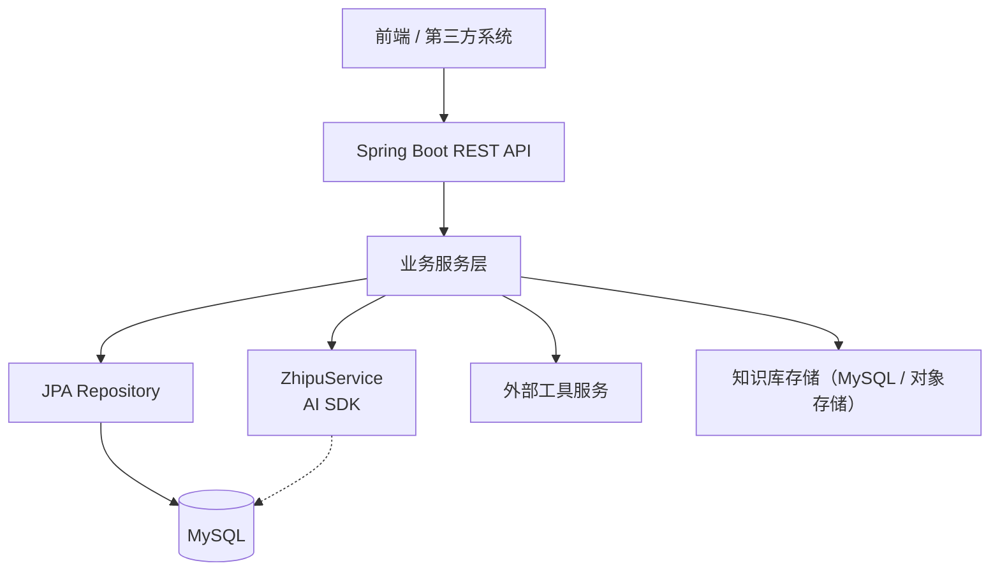
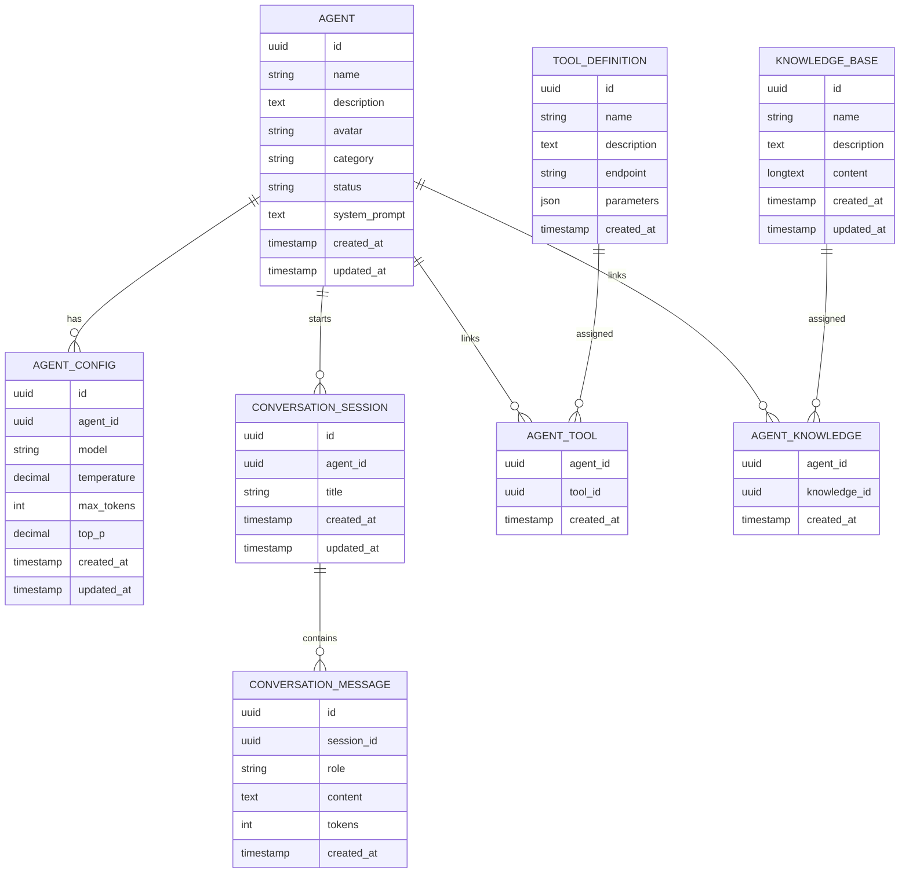

# Agent 管理系统开发计划

## 1. 项目概览
- **目标**：构建一套可配置、可扩展的 Agent 管理平台，支撑多模型对话、工具调用与知识库扩展能力。
- **范围**：涵盖 Agent 基础信息、参数配置、对话历史、工具与知识库关联、API 文档与测试体系。
- **排除项**：不含前端 UI 设计与实现、不含模型推理层创新算法。
- **里程碑**：基础设施 → Agent 核心功能 → 对话历史 → 工具/知识库 → 文档与优化。

## 2. 技术架构
- **后端框架**：Spring Boot 3.5.x（Java 17）
- **数据层**：Spring Data JPA + MySQL 8.0
- **数据库迁移**：Flyway
- **文档**：SpringDoc OpenAPI 3.0
- **AI SDK**：智谱 AI SDK 0.0.6
- **测试**：JUnit 5 + Mockito
- **构建/依赖**：Maven

## 3. 核心模块与职责
- **Agent 基础管理**：Agent 元信息 CRUD、分类、状态切换、系统提示词维护。
- **提示词管理**：管理系统/角色/知识库提示词模板并与 Agent 关联。
- **参数配置管理**：维护模型参数（模型、温度、TopP、最大 Token 等）并在会话请求时动态加载。
- **对话历史管理**：持久化会话与消息，支持上下文加载和历史查询。
- **工具调用管理**：定义工具接口、记录调用日志、配置 Agent 工具关联。
- **知识库管理**：知识库文档上传、Agent 关联、检索配置。

## 4. 数据库设计

### 表设计说明
- 采用 `UUID` 作为主键，降低分布式环境下冲突概率。
- 所有记录保留 `created_at` / `updated_at` 字段，使用数据库默认值 + 触发器或 JPA 自动更新。
- 提示词细分字段可单独建立 `prompt_template` 表（后续迭代），当前可使用 `agent` 表中的 `system_prompt` 存储基础提示词。
- `tool_definition.parameters` 字段建议使用 JSON Schema 描述工具参数。
- 对消息存储可结合 `tokens` 字段进行费用和限流统计。

## 5. API 设计概览

| 模块 | 方法 | 路径 | 功能概要 |
| --- | --- | --- | --- |
| Agent | POST | `/api/agents` | 创建 Agent，包含基础信息与默认提示词 |
| Agent | GET | `/api/agents` | 查询 Agent 列表，支持分类、状态过滤 |
| Agent | GET | `/api/agents/{id}` | 获取 Agent 详情，包含配置、工具、知识库 |
| Agent | PUT | `/api/agents/{id}` | 更新 Agent 基础信息 |
| Agent | DELETE | `/api/agents/{id}` | 删除 Agent（软删除优先） |
| Agent 配置 | PUT | `/api/agents/{id}/config` | 更新 Agent 参数配置 |
| 对话 | GET | `/api/sessions` | 查询会话列表 |
| 对话 | GET | `/api/sessions/{id}` | 查看会话详情（含消息摘要） |
| 对话 | GET | `/api/sessions/{id}/messages` | 获取消息历史 |
| 对话 | DELETE | `/api/sessions/{id}` | 删除会话及消息 |
| 工具 | POST | `/api/tools` | 创建工具定义 |
| 工具 | GET | `/api/tools` | 查询工具列表 |
| 工具关联 | PUT | `/api/agents/{agentId}/tools` | 批量更新 Agent 工具关联 |
| 知识库 | POST | `/api/knowledge` | 创建知识库 |
| 知识库 | GET | `/api/knowledge` | 查询知识库列表 |
| 知识库关联 | PUT | `/api/agents/{agentId}/knowledge` | 批量更新 Agent 知识库关联 |

> 详细的请求/响应 DTO 与错误码设计将结合 SpringDoc OpenAPI 生成文档。

## 6. 开发阶段规划

### 阶段一：基础设施
- 更新 `pom.xml`，新增 MySQL、Spring Data JPA、Flyway、SpringDoc 依赖。
- 配置 `application.yml` 数据源、JPA、Flyway 参数（区分 dev/prod profile）。
- 编写 Flyway 迁移脚本：`V1__init_schema.sql`（创建全部核心表）。
- 验证项目启动、数据库连接与迁移执行。

### 阶段二：Agent 核心功能
- 定义实体：`Agent`, `AgentConfig`；DTO：`AgentDTO`, `AgentCreateRequest`, `AgentUpdateRequest`。
- 创建 Repository：`AgentRepository`, `AgentConfigRepository`。
- 实现 Service：`AgentService`，包含 CRUD、配置更新、关联查询。
- 实现 Controller：`AgentController`，暴露基础 REST API。
- 覆盖单元测试：`AgentServiceTest`, `AgentControllerTest`（MockMvc）。

### 阶段三：对话历史管理
- 定义实体：`ConversationSession`, `ConversationMessage`。
- 实现 `ConversationService`，支持创建/查询/删除会话与消息。
- 改造 `ZhipuService`：会话请求时记录消息；响应后写入 Assistant 消息；可根据 Agent 配置加载历史上下文。
- 新增 `ConversationController`，提供历史查询接口。

### 阶段四：进阶功能
- 工具模块：实体 `ToolDefinition`, `AgentTool`；Service/Controller；工具调用日志（可扩展）。
- 知识库模块：实体 `KnowledgeBase`, `AgentKnowledge`；Service/Controller；支持文件上传或富文本。
- 与 Agent Service 集成，提供批量维护接口。

### 阶段五：优化与文档
- 为 API 添加 SpringDoc 注解、启用 `/swagger-ui.html`。
- 编写集成测试（使用 Testcontainers/MySQL 8）。
- 数据库优化：添加索引、考虑分区或归档策略。
- 完成技术文档、部署指南、Mermaid 架构/ER 图。
- 设置监控与告警（可选：Actuator + Prometheus）。

## 7. 测试策略
- **单元测试**：Service 层使用 Mockito 模拟 Repository；Controller 使用 MockMvc。
- **集成测试**：关键 API 使用 Testcontainers MySQL 保证 Flyway 脚本可执行。
- **契约测试**：OpenAPI 生成客户端校验；必要时编写 JSON Schema。
- **性能测试**：关键接口使用 JMeter/Locust 进行并发验证。

## 8. 安全与合规
- 实现鉴权（后续版本可接入 JWT/OAuth2）；当前阶段至少限制内部调用。
- 对敏感参数（API Key、系统提示词）加密存储或使用配置中心。
- Flyway 脚本要求可回滚策略，避免生产数据损坏。
- 审计日志记录 Agent 配置变更与工具调用。

## 9. 集成改造要点
- `ChatController` 增加 `agentId` 参数，校验 Agent 状态是否可用。
- `ZhipuService` 根据 Agent 配置动态设置模型、温度、最大 Token、TopP。
- 请求前加载最近 N 条历史对话上下文；请求后保存用户与助手消息。
- 将工具/知识库上下文传入提示词模板，以支撑更强的 Agent 能力。

## 10. 运维与部署
- 建议使用 Docker Compose 或 K8s 管理服务，提供 MySQL/Flyway 初始化。
- 配置 CI（GitHub Actions）执行测试、Flyway 校验、代码质量扫描。
- 打包方式：利用 Maven `spring-boot-maven-plugin` 生成自包含 JAR。
- 监控：Spring Boot Actuator + Prometheus/Grafana；日志集中化（ELK）。

## 11. 风险与对策
- **数据一致性**：使用事务管理，配合悲观/乐观锁处理并发更新。
- **模型参数错误**：增加配置校验与默认兜底，避免触发 API 限制。
- **工具调用失败**：提供重试与熔断策略，记录失败日志。
- **知识库体积扩大**：后续可拆分为对象存储 + 索引服务（如 Milvus、ES）。
- **合规风险**：对知识库内容进行敏感词过滤与权限管控。

## 12. 待办清单
- [ ] 添加 MySQL、JPA、Flyway 等依赖到 `pom.xml`
- [ ] 配置数据库连接和 Flyway 迁移
- [ ] 创建数据库迁移脚本（建表 SQL）
- [ ] 创建 Agent 相关实体类和 DTO
- [ ] 创建 Agent Repository 层
- [ ] 实现 `AgentService` 业务逻辑
- [ ] 创建 Agent REST API 接口
- [ ] 编写 Agent 模块单元测试
- [ ] 创建会话和消息实体
- [ ] 实现对话历史管理 Service
- [ ] 集成对话历史到现有 Chat 接口
- [ ] 实现工具管理模块（Entity、Service、Controller）
- [ ] 实现知识库管理模块（Entity、Service、Controller）
- [ ] 添加 SpringDoc API 文档和注解
- [ ] 生成技术设计文档（包含 Mermaid 图表）

---

以上计划可作为后续迭代的执行指南，建议结合项目管理工具（如 Jira、Linear）拆分成更细粒度的任务与时间节点。
