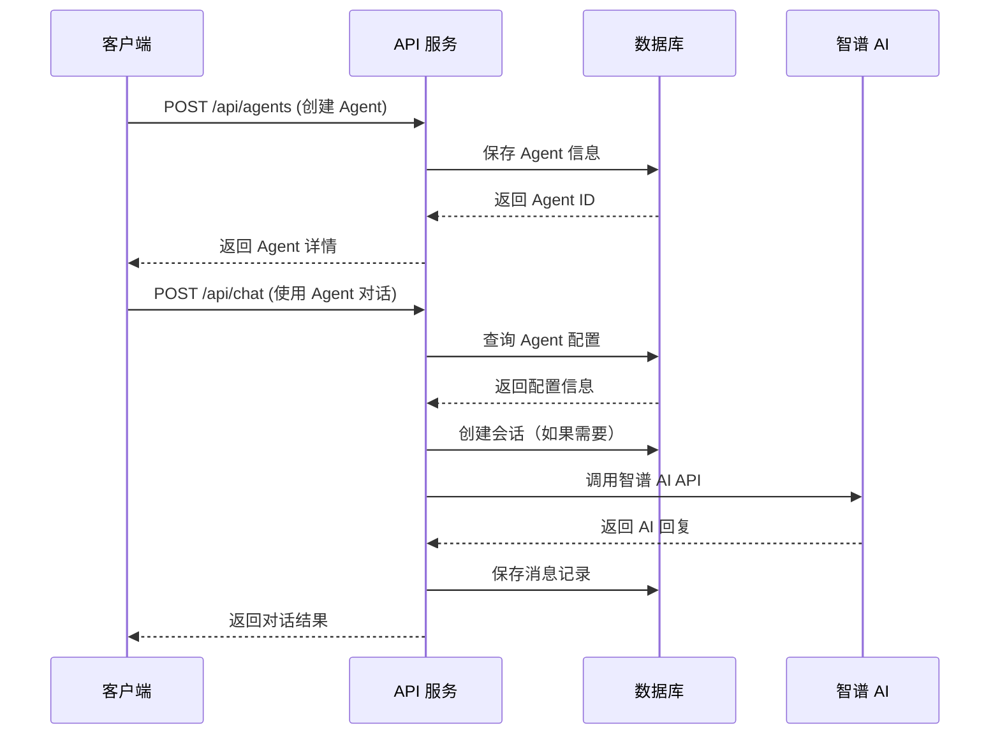
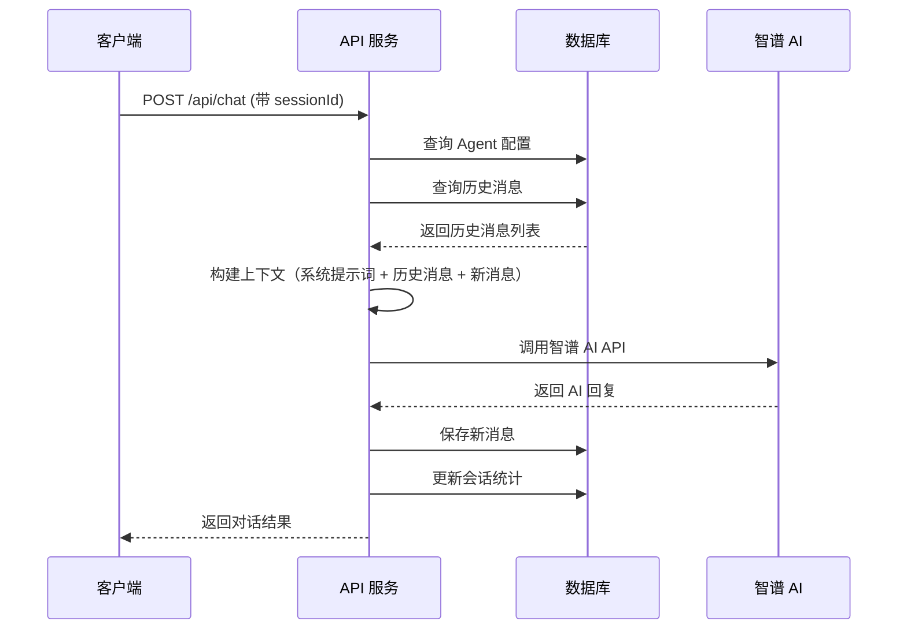

# Agent 管理系统 API 设计文档

## 1. 概述

本文档描述 piteAgents 系统的 RESTful API 设计，遵循 REST 架构风格，使用 JSON 格式进行数据交互。

### 1.1 设计原则

- **RESTful 风格**: 使用标准 HTTP 方法（GET、POST、PUT、DELETE）
- **统一响应格式**: 所有接口返回统一的 ApiResponse 结构
- **资源命名**: 使用复数名词表示资源集合
- **版本管理**: 通过 URL 路径进行版本控制（/api/v1/）
- **错误处理**: 使用标准 HTTP 状态码和详细错误信息

### 1.2 通用响应格式

```json
{
  "code": 200,
  "message": "success",
  "data": {}
}
```

### 1.3 HTTP 状态码

| 状态码 | 说明 | 使用场景 |
|--------|------|----------|
| 200 | OK | 请求成功 |
| 201 | Created | 资源创建成功 |
| 400 | Bad Request | 请求参数错误 |
| 404 | Not Found | 资源不存在 |
| 500 | Internal Server Error | 服务器内部错误 |

## 2. Agent 管理 API

### 2.1 创建 Agent

**接口**: `POST /api/agents`

**请求体**:
```json
{
  "name": "编程助手",
  "description": "专业的编程辅导 AI",
  "avatar": "https://example.com/avatar.png",
  "category": "编程",
  "systemPrompt": "你是一个专业的编程助手，擅长解答编程问题。",
  "rolePrompt": "请用清晰、易懂的方式解释技术概念。",
  "config": {
    "model": "glm-4.6",
    "temperature": 0.7,
    "maxTokens": 2000,
    "topP": 0.95
  }
}
```

**响应**:
```json
{
  "code": 200,
  "message": "success",
  "data": {
    "id": 1,
    "name": "编程助手",
    "description": "专业的编程辅导 AI",
    "avatar": "https://example.com/avatar.png",
    "category": "编程",
    "status": "ACTIVE",
    "systemPrompt": "你是一个专业的编程助手，擅长解答编程问题。",
    "rolePrompt": "请用清晰、易懂的方式解释技术概念。",
    "isActive": true,
    "config": {
      "model": "glm-4.6",
      "temperature": 0.7,
      "maxTokens": 2000,
      "topP": 0.95
    },
    "createdAt": "2025-10-24T10:00:00",
    "updatedAt": "2025-10-24T10:00:00"
  }
}
```

---

### 2.2 查询 Agent 列表

**接口**: `GET /api/agents`

**查询参数**:
- `page`: 页码（从 0 开始，默认 0）
- `size`: 每页大小（默认 10）
- `category`: 分类过滤（可选）
- `status`: 状态过滤（可选）
- `keyword`: 关键词搜索（可选，搜索名称和描述）

**示例**: `GET /api/agents?page=0&size=10&category=编程`

**响应**:
```json
{
  "code": 200,
  "message": "success",
  "data": {
    "content": [
      {
        "id": 1,
        "name": "编程助手",
        "description": "专业的编程辅导 AI",
        "avatar": "https://example.com/avatar.png",
        "category": "编程",
        "status": "ACTIVE",
        "isActive": true,
        "createdAt": "2025-10-24T10:00:00",
        "updatedAt": "2025-10-24T10:00:00"
      }
    ],
    "pageable": {
      "pageNumber": 0,
      "pageSize": 10
    },
    "totalElements": 1,
    "totalPages": 1
  }
}
```

---

### 2.3 获取 Agent 详情

**接口**: `GET /api/agents/{id}`

**路径参数**:
- `id`: Agent ID

**响应**:
```json
{
  "code": 200,
  "message": "success",
  "data": {
    "id": 1,
    "name": "编程助手",
    "description": "专业的编程辅导 AI",
    "avatar": "https://example.com/avatar.png",
    "category": "编程",
    "status": "ACTIVE",
    "systemPrompt": "你是一个专业的编程助手，擅长解答编程问题。",
    "rolePrompt": "请用清晰、易懂的方式解释技术概念。",
    "isActive": true,
    "config": {
      "model": "glm-4.6",
      "temperature": 0.7,
      "maxTokens": 2000,
      "topP": 0.95
    },
    "tools": [],
    "knowledgeBases": [],
    "createdAt": "2025-10-24T10:00:00",
    "updatedAt": "2025-10-24T10:00:00"
  }
}
```

---

### 2.4 更新 Agent

**接口**: `PUT /api/agents/{id}`

**路径参数**:
- `id`: Agent ID

**请求体**:
```json
{
  "name": "高级编程助手",
  "description": "更专业的编程辅导 AI",
  "avatar": "https://example.com/new-avatar.png",
  "category": "编程",
  "systemPrompt": "你是一个高级编程助手...",
  "rolePrompt": "请提供深入的技术见解...",
  "status": "ACTIVE"
}
```

**响应**: 同创建 Agent 响应格式

---

### 2.5 删除 Agent（软删除）

**接口**: `DELETE /api/agents/{id}`

**路径参数**:
- `id`: Agent ID

**响应**:
```json
{
  "code": 200,
  "message": "Agent 删除成功"
}
```

---

### 2.6 更新 Agent 配置

**接口**: `PUT /api/agents/{id}/config`

**路径参数**:
- `id`: Agent ID

**请求体**:
```json
{
  "model": "glm-4.5",
  "temperature": 0.8,
  "maxTokens": 3000,
  "topP": 0.9
}
```

**响应**:
```json
{
  "code": 200,
  "message": "配置更新成功",
  "data": {
    "model": "glm-4.5",
    "temperature": 0.8,
    "maxTokens": 3000,
    "topP": 0.9
  }
}
```

---

### 2.7 切换 Agent 状态

**接口**: `PUT /api/agents/{id}/status`

**路径参数**:
- `id`: Agent ID

**请求体**:
```json
{
  "status": "INACTIVE"
}
```

**响应**:
```json
{
  "code": 200,
  "message": "状态更新成功"
}
```

---

## 3. 对话管理 API（集成 Agent）

### 3.1 使用 Agent 进行对话（同步）

**接口**: `POST /api/chat`

**请求体**:
```json
{
  "agentId": 1,
  "sessionId": null,
  "messages": [
    {
      "role": "user",
      "content": "什么是 Java？"
    }
  ]
}
```

**说明**:
- `agentId`: 使用的 Agent ID（必填）
- `sessionId`: 会话 ID（可选，不传则创建新会话）
- `messages`: 消息列表（会自动加载历史消息）

**响应**:
```json
{
  "code": 200,
  "message": "success",
  "data": {
    "id": "response-id-123",
    "sessionId": 1001,
    "model": "glm-4.6",
    "content": "Java 是一种广泛使用的面向对象编程语言...",
    "finishReason": "stop",
    "usage": {
      "promptTokens": 20,
      "completionTokens": 100,
      "totalTokens": 120
    }
  }
}
```

---

### 3.2 使用 Agent 进行流式对话

**接口**: `POST /api/chat/stream`

**请求体**: 同 3.1

**响应**: SSE 流式响应

---

## 4. 会话历史 API

### 4.1 获取会话列表

**接口**: `GET /api/sessions`

**查询参数**:
- `agentId`: Agent ID（可选，过滤特定 Agent 的会话）
- `page`: 页码（默认 0）
- `size`: 每页大小（默认 20）

**响应**:
```json
{
  "code": 200,
  "message": "success",
  "data": {
    "content": [
      {
        "id": 1001,
        "agentId": 1,
        "agentName": "编程助手",
        "title": "Java 学习咨询",
        "summary": "用户询问 Java 相关知识",
        "messageCount": 10,
        "totalTokens": 1500,
        "createdAt": "2025-10-24T10:00:00",
        "updatedAt": "2025-10-24T11:00:00"
      }
    ],
    "totalElements": 5,
    "totalPages": 1
  }
}
```

---

### 4.2 获取会话详情

**接口**: `GET /api/sessions/{id}`

**路径参数**:
- `id`: 会话 ID

**响应**:
```json
{
  "code": 200,
  "message": "success",
  "data": {
    "id": 1001,
    "agentId": 1,
    "agentName": "编程助手",
    "title": "Java 学习咨询",
    "summary": "用户询问 Java 相关知识",
    "messageCount": 10,
    "totalTokens": 1500,
    "createdAt": "2025-10-24T10:00:00",
    "updatedAt": "2025-10-24T11:00:00"
  }
}
```

---

### 4.3 获取会话消息历史

**接口**: `GET /api/sessions/{id}/messages`

**路径参数**:
- `id`: 会话 ID

**查询参数**:
- `page`: 页码（默认 0）
- `size`: 每页大小（默认 50）

**响应**:
```json
{
  "code": 200,
  "message": "success",
  "data": {
    "content": [
      {
        "id": 10001,
        "sessionId": 1001,
        "role": "user",
        "content": "什么是 Java？",
        "promptTokens": 0,
        "completionTokens": 0,
        "totalTokens": 5,
        "createdAt": "2025-10-24T10:00:00"
      },
      {
        "id": 10002,
        "sessionId": 1001,
        "role": "assistant",
        "content": "Java 是一种广泛使用的面向对象编程语言...",
        "promptTokens": 20,
        "completionTokens": 100,
        "totalTokens": 120,
        "createdAt": "2025-10-24T10:00:05"
      }
    ],
    "totalElements": 10
  }
}
```

---

### 4.4 删除会话

**接口**: `DELETE /api/sessions/{id}`

**路径参数**:
- `id`: 会话 ID

**响应**:
```json
{
  "code": 200,
  "message": "会话删除成功"
}
```

---

### 4.5 更新会话标题

**接口**: `PUT /api/sessions/{id}/title`

**路径参数**:
- `id`: 会话 ID

**请求体**:
```json
{
  "title": "Java 入门指南"
}
```

**响应**:
```json
{
  "code": 200,
  "message": "标题更新成功"
}
```

---

## 5. 工具管理 API

### 5.1 创建工具

**接口**: `POST /api/tools`

**请求体**:
```json
{
  "name": "天气查询",
  "description": "查询指定城市的天气信息",
  "endpoint": "https://api.weather.com/query",
  "method": "POST",
  "parameters": {
    "type": "object",
    "properties": {
      "city": {
        "type": "string",
        "description": "城市名称"
      }
    },
    "required": ["city"]
  },
  "headers": {
    "Content-Type": "application/json"
  }
}
```

**响应**:
```json
{
  "code": 200,
  "message": "success",
  "data": {
    "id": 1,
    "name": "天气查询",
    "description": "查询指定城市的天气信息",
    "endpoint": "https://api.weather.com/query",
    "method": "POST",
    "parameters": {...},
    "isActive": true,
    "createdAt": "2025-10-24T10:00:00"
  }
}
```

---

### 5.2 获取工具列表

**接口**: `GET /api/tools`

**查询参数**:
- `page`: 页码（默认 0）
- `size`: 每页大小（默认 20）
- `isActive`: 是否启用（可选）

**响应**: 分页列表格式

---

### 5.3 关联工具到 Agent

**接口**: `POST /api/agents/{agentId}/tools`

**路径参数**:
- `agentId`: Agent ID

**请求体**:
```json
{
  "toolIds": [1, 2, 3],
  "configs": {
    "1": {
      "sortOrder": 1,
      "enabled": true
    },
    "2": {
      "sortOrder": 2,
      "enabled": true
    }
  }
}
```

**响应**:
```json
{
  "code": 200,
  "message": "工具关联成功"
}
```

---

### 5.4 获取 Agent 的工具列表

**接口**: `GET /api/agents/{agentId}/tools`

**路径参数**:
- `agentId`: Agent ID

**响应**:
```json
{
  "code": 200,
  "message": "success",
  "data": [
    {
      "id": 1,
      "name": "天气查询",
      "description": "查询指定城市的天气信息",
      "sortOrder": 1,
      "enabled": true
    }
  ]
}
```

---

## 6. 知识库管理 API

### 6.1 创建知识库

**接口**: `POST /api/knowledge`

**请求体**:
```json
{
  "name": "Java 编程指南",
  "description": "Java 基础和进阶知识",
  "content": "# Java 简介\n\nJava 是一种...",
  "contentType": "MARKDOWN"
}
```

**响应**:
```json
{
  "code": 200,
  "message": "success",
  "data": {
    "id": 1,
    "name": "Java 编程指南",
    "description": "Java 基础和进阶知识",
    "contentType": "MARKDOWN",
    "charCount": 5000,
    "createdAt": "2025-10-24T10:00:00"
  }
}
```

---

### 6.2 获取知识库列表

**接口**: `GET /api/knowledge`

**查询参数**:
- `page`: 页码（默认 0）
- `size`: 每页大小（默认 20）
- `contentType`: 内容类型过滤（可选）

**响应**: 分页列表格式

---

### 6.3 关联知识库到 Agent

**接口**: `POST /api/agents/{agentId}/knowledge`

**路径参数**:
- `agentId`: Agent ID

**请求体**:
```json
{
  "knowledgeIds": [1, 2],
  "priorities": {
    "1": 10,
    "2": 5
  }
}
```

**响应**:
```json
{
  "code": 200,
  "message": "知识库关联成功"
}
```

---

### 6.4 获取 Agent 的知识库列表

**接口**: `GET /api/agents/{agentId}/knowledge`

**路径参数**:
- `agentId`: Agent ID

**响应**:
```json
{
  "code": 200,
  "message": "success",
  "data": [
    {
      "id": 1,
      "name": "Java 编程指南",
      "description": "Java 基础和进阶知识",
      "priority": 10,
      "charCount": 5000
    }
  ]
}
```

---

## 7. API 调用流程图

### 7.1 创建 Agent 并进行对话



### 7.2 加载历史对话并继续



---

## 8. 错误码定义

| 错误码 | 说明 | 解决方案 |
|--------|------|----------|
| 40001 | Agent 不存在 | 检查 Agent ID 是否正确 |
| 40002 | 会话不存在 | 检查 Session ID 是否正确 |
| 40003 | 参数校验失败 | 检查请求参数格式 |
| 40004 | Agent 已禁用 | 启用 Agent 后再试 |
| 50001 | 智谱 AI 调用失败 | 检查 API 配置和网络连接 |
| 50002 | 数据库操作失败 | 联系系统管理员 |

---

## 9. 最佳实践

### 9.1 分页查询
建议使用合理的分页大小（10-50），避免一次查询过多数据。

### 9.2 会话管理
- 建议为每个独立的对话话题创建新会话
- 定期清理过期会话，避免数据膨胀

### 9.3 Token 控制
- 监控 Token 使用量，避免超出限制
- 合理设置 maxTokens 参数

### 9.4 提示词优化
- 系统提示词应简洁明确
- 角色提示词用于细化行为规范
- 定期根据效果调整提示词

---

**文档版本**: 1.0.0  
**最后更新**: 2025-10-24  
**维护者**: piteAgents Team

