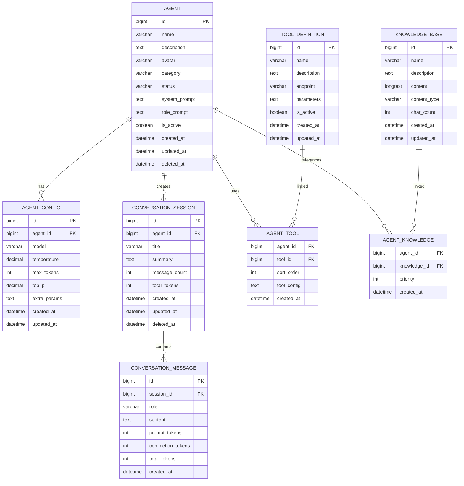

# Agent 管理系统数据库设计文档

## 1. 概述

本文档描述 piteAgents 系统的数据库设计，采用 MySQL 8.0+ 作为关系型数据库，使用 Flyway 进行版本管理和迁移。

### 1.1 设计原则

- **规范化设计**: 遵循第三范式（3NF），减少数据冗余
- **可扩展性**: 预留扩展字段，支持未来功能迭代
- **性能优化**: 合理设置索引，优化查询性能
- **数据完整性**: 使用外键约束保证数据一致性
- **软删除**: 核心业务表支持软删除，避免数据丢失
- **审计追踪**: 记录创建时间、更新时间等审计信息

### 1.2 命名规范

- **表名**: 小写下划线命名，如 `agent`, `conversation_session`
- **字段名**: 小写下划线命名，如 `created_at`, `system_prompt`
- **主键**: 统一使用 `id`，类型为 `BIGINT` 自增
- **外键**: 使用 `{表名}_id` 格式，如 `agent_id`
- **时间戳**: 使用 `created_at`, `updated_at`, `deleted_at`
- **状态字段**: 使用 `status`, `is_active` 等布尔或枚举类型

## 2. 数据库架构图



## 3. 表结构详细设计

### 3.1 agent（Agent 基础信息表）

**功能说明**: 存储 AI Agent 的基础信息，包括名称、描述、提示词等核心配置。

| 字段名 | 类型 | 长度 | 约束 | 默认值 | 说明 |
|--------|------|------|------|--------|------|
| id | BIGINT | - | PK, AUTO_INCREMENT | - | 主键ID |
| name | VARCHAR | 100 | NOT NULL | - | Agent 名称 |
| description | TEXT | - | NULL | - | Agent 描述 |
| avatar | VARCHAR | 255 | NULL | - | Agent 头像URL |
| category | VARCHAR | 50 | NULL | - | Agent 分类（如：编程助手、写作助手等）|
| status | VARCHAR | 20 | NOT NULL | 'ACTIVE' | 状态（ACTIVE/INACTIVE/ARCHIVED）|
| system_prompt | TEXT | - | NULL | - | 系统提示词 |
| role_prompt | TEXT | - | NULL | - | 角色提示词 |
| is_active | BOOLEAN | - | NOT NULL | TRUE | 是否启用 |
| created_at | DATETIME | - | NOT NULL | CURRENT_TIMESTAMP | 创建时间 |
| updated_at | DATETIME | - | NOT NULL | CURRENT_TIMESTAMP ON UPDATE | 更新时间 |
| deleted_at | DATETIME | - | NULL | - | 软删除时间 |

**索引设计**:
- PRIMARY KEY: `id`
- INDEX: `idx_name` (name)
- INDEX: `idx_category` (category)
- INDEX: `idx_status` (status)
- INDEX: `idx_created_at` (created_at)

**扩展字段建议**:
- `tags`: JSON 类型，存储标签数组
- `metadata`: JSON 类型，存储扩展元数据
- `version`: INT 类型，版本号

---

### 3.2 agent_config（Agent 参数配置表）

**功能说明**: 存储 Agent 的运行参数配置，包括模型选择、温度参数等。

| 字段名 | 类型 | 长度 | 约束 | 默认值 | 说明 |
|--------|------|------|------|--------|------|
| id | BIGINT | - | PK, AUTO_INCREMENT | - | 主键ID |
| agent_id | BIGINT | - | NOT NULL, FK | - | 关联的 Agent ID |
| model | VARCHAR | 50 | NOT NULL | 'glm-4.6' | 模型代码 |
| temperature | DECIMAL | (3,2) | NOT NULL | 0.70 | 温度参数（0.00-1.00）|
| max_tokens | INT | - | NOT NULL | 2000 | 最大 Token 数 |
| top_p | DECIMAL | (3,2) | NULL | 0.95 | Top P 参数 |
| extra_params | TEXT | - | NULL | - | 其他参数（JSON 格式）|
| created_at | DATETIME | - | NOT NULL | CURRENT_TIMESTAMP | 创建时间 |
| updated_at | DATETIME | - | NOT NULL | CURRENT_TIMESTAMP ON UPDATE | 更新时间 |

**索引设计**:
- PRIMARY KEY: `id`
- UNIQUE INDEX: `uk_agent_id` (agent_id) - 一个 Agent 只有一个配置
- FOREIGN KEY: `fk_agent_config_agent` (agent_id) REFERENCES agent(id) ON DELETE CASCADE

**约束说明**:
- temperature: 范围 0.00-1.00
- top_p: 范围 0.00-1.00
- max_tokens: 最小值 1

---

### 3.3 conversation_session（会话表）

**功能说明**: 存储对话会话信息，一个会话包含多轮对话消息。

| 字段名 | 类型 | 长度 | 约束 | 默认值 | 说明 |
|--------|------|------|------|--------|------|
| id | BIGINT | - | PK, AUTO_INCREMENT | - | 主键ID |
| agent_id | BIGINT | - | NOT NULL, FK | - | 关联的 Agent ID |
| title | VARCHAR | 200 | NOT NULL | - | 会话标题 |
| summary | TEXT | - | NULL | - | 会话摘要 |
| message_count | INT | - | NOT NULL | 0 | 消息数量 |
| total_tokens | INT | - | NOT NULL | 0 | 总 Token 消耗 |
| created_at | DATETIME | - | NOT NULL | CURRENT_TIMESTAMP | 创建时间 |
| updated_at | DATETIME | - | NOT NULL | CURRENT_TIMESTAMP ON UPDATE | 更新时间 |
| deleted_at | DATETIME | - | NULL | - | 软删除时间 |

**索引设计**:
- PRIMARY KEY: `id`
- INDEX: `idx_agent_id` (agent_id)
- INDEX: `idx_created_at` (created_at DESC)
- FOREIGN KEY: `fk_session_agent` (agent_id) REFERENCES agent(id) ON DELETE CASCADE

**业务规则**:
- 会话标题可由第一条用户消息自动生成
- message_count 和 total_tokens 通过触发器或应用层维护
- 支持软删除，保留历史记录

---

### 3.4 conversation_message（消息记录表）

**功能说明**: 存储会话中的每条消息，包括用户消息和 AI 回复。

| 字段名 | 类型 | 长度 | 约束 | 默认值 | 说明 |
|--------|------|------|------|--------|------|
| id | BIGINT | - | PK, AUTO_INCREMENT | - | 主键ID |
| session_id | BIGINT | - | NOT NULL, FK | - | 关联的会话 ID |
| role | VARCHAR | 20 | NOT NULL | - | 角色（system/user/assistant）|
| content | TEXT | - | NOT NULL | - | 消息内容 |
| prompt_tokens | INT | - | NULL | 0 | 提示词 Token 数 |
| completion_tokens | INT | - | NULL | 0 | 生成内容 Token 数 |
| total_tokens | INT | - | NULL | 0 | 总 Token 数 |
| created_at | DATETIME | - | NOT NULL | CURRENT_TIMESTAMP | 创建时间 |

**索引设计**:
- PRIMARY KEY: `id`
- INDEX: `idx_session_id_created_at` (session_id, created_at)
- INDEX: `idx_role` (role)
- FOREIGN KEY: `fk_message_session` (session_id) REFERENCES conversation_session(id) ON DELETE CASCADE

**查询优化**:
- 按会话ID和时间排序查询消息时，使用复合索引 `idx_session_id_created_at`
- 考虑对 content 字段进行全文索引（FULLTEXT）以支持搜索

---

### 3.5 tool_definition（工具定义表）

**功能说明**: 定义可供 Agent 调用的外部工具或 API。

| 字段名 | 类型 | 长度 | 约束 | 默认值 | 说明 |
|--------|------|------|------|--------|------|
| id | BIGINT | - | PK, AUTO_INCREMENT | - | 主键ID |
| name | VARCHAR | 100 | NOT NULL | - | 工具名称 |
| description | TEXT | - | NOT NULL | - | 工具描述 |
| endpoint | VARCHAR | 500 | NOT NULL | - | API 端点 URL |
| parameters | TEXT | - | NULL | - | 参数定义（JSON Schema）|
| method | VARCHAR | 10 | NOT NULL | 'POST' | HTTP 方法（GET/POST/PUT等）|
| headers | TEXT | - | NULL | - | 请求头配置（JSON）|
| is_active | BOOLEAN | - | NOT NULL | TRUE | 是否启用 |
| created_at | DATETIME | - | NOT NULL | CURRENT_TIMESTAMP | 创建时间 |
| updated_at | DATETIME | - | NOT NULL | CURRENT_TIMESTAMP ON UPDATE | 更新时间 |

**索引设计**:
- PRIMARY KEY: `id`
- UNIQUE INDEX: `uk_name` (name)
- INDEX: `idx_is_active` (is_active)

**扩展字段建议**:
- `timeout`: INT 类型，超时时间（毫秒）
- `retry_count`: INT 类型，重试次数
- `auth_type`: VARCHAR 类型，认证类型（API_KEY/OAUTH2等）

---

### 3.6 agent_tool（Agent 工具关联表）

**功能说明**: 关联 Agent 和工具的多对多关系表。

| 字段名 | 类型 | 长度 | 约束 | 默认值 | 说明 |
|--------|------|------|------|--------|------|
| agent_id | BIGINT | - | PK, FK | - | Agent ID |
| tool_id | BIGINT | - | PK, FK | - | 工具ID |
| sort_order | INT | - | NOT NULL | 0 | 排序顺序 |
| tool_config | TEXT | - | NULL | - | 工具个性化配置（JSON）|
| created_at | DATETIME | - | NOT NULL | CURRENT_TIMESTAMP | 创建时间 |

**索引设计**:
- PRIMARY KEY: (agent_id, tool_id)
- INDEX: `idx_agent_id` (agent_id)
- INDEX: `idx_tool_id` (tool_id)
- FOREIGN KEY: `fk_agent_tool_agent` (agent_id) REFERENCES agent(id) ON DELETE CASCADE
- FOREIGN KEY: `fk_agent_tool_tool` (tool_id) REFERENCES tool_definition(id) ON DELETE CASCADE

**业务规则**:
- sort_order 用于控制工具的调用优先级
- tool_config 可以覆盖工具的默认配置

---

### 3.7 knowledge_base（知识库表）

**功能说明**: 存储知识库内容，可供 Agent 引用。

| 字段名 | 类型 | 长度 | 约束 | 默认值 | 说明 |
|--------|------|------|------|--------|------|
| id | BIGINT | - | PK, AUTO_INCREMENT | - | 主键ID |
| name | VARCHAR | 200 | NOT NULL | - | 知识库名称 |
| description | TEXT | - | NULL | - | 知识库描述 |
| content | LONGTEXT | - | NOT NULL | - | 知识库内容 |
| content_type | VARCHAR | 50 | NOT NULL | 'TEXT' | 内容类型（TEXT/MARKDOWN/JSON）|
| char_count | INT | - | NOT NULL | 0 | 字符数 |
| file_path | VARCHAR | 500 | NULL | - | 文件路径（如果是上传文件）|
| created_at | DATETIME | - | NOT NULL | CURRENT_TIMESTAMP | 创建时间 |
| updated_at | DATETIME | - | NOT NULL | CURRENT_TIMESTAMP ON UPDATE | 更新时间 |

**索引设计**:
- PRIMARY KEY: `id`
- INDEX: `idx_name` (name)
- INDEX: `idx_content_type` (content_type)
- FULLTEXT INDEX: `ft_content` (content) - 支持全文搜索

**扩展字段建议**:
- `embedding_vector`: BLOB 类型，向量嵌入（用于语义检索）
- `vector_model`: VARCHAR 类型，嵌入模型名称
- `chunk_size`: INT 类型，分块大小

---

### 3.8 agent_knowledge（Agent 知识库关联表）

**功能说明**: 关联 Agent 和知识库的多对多关系表。

| 字段名 | 类型 | 长度 | 约束 | 默认值 | 说明 |
|--------|------|------|------|--------|------|
| agent_id | BIGINT | - | PK, FK | - | Agent ID |
| knowledge_id | BIGINT | - | PK, FK | - | 知识库ID |
| priority | INT | - | NOT NULL | 0 | 优先级（数字越大优先级越高）|
| created_at | DATETIME | - | NOT NULL | CURRENT_TIMESTAMP | 创建时间 |

**索引设计**:
- PRIMARY KEY: (agent_id, knowledge_id)
- INDEX: `idx_agent_id` (agent_id)
- INDEX: `idx_knowledge_id` (knowledge_id)
- FOREIGN KEY: `fk_agent_knowledge_agent` (agent_id) REFERENCES agent(id) ON DELETE CASCADE
- FOREIGN KEY: `fk_agent_knowledge_kb` (knowledge_id) REFERENCES knowledge_base(id) ON DELETE CASCADE

**业务规则**:
- priority 用于在多个知识库中确定检索优先级
- 可以扩展为包含检索配置字段

---

## 4. 数据迁移策略

### 4.1 Flyway 版本管理

采用 Flyway 进行数据库版本管理，迁移脚本命名规范：

```
V{版本号}__{描述}.sql
```

示例：
- `V1.0.0__init_tables.sql` - 初始化表结构
- `V1.0.1__add_agent_metadata.sql` - 添加 Agent 元数据字段
- `V1.1.0__add_tool_management.sql` - 添加工具管理相关表

### 4.2 迁移脚本组织

```
src/main/resources/db/migration/
├── V1.0.0__init_agent_tables.sql
├── V1.0.1__init_conversation_tables.sql
├── V1.0.2__init_tool_tables.sql
├── V1.0.3__init_knowledge_tables.sql
└── V1.0.4__init_indexes_and_constraints.sql
```

## 5. 数据字典

### 5.1 枚举类型

#### Agent Status（Agent 状态）
- `ACTIVE`: 激活状态
- `INACTIVE`: 未激活状态
- `ARCHIVED`: 已归档状态

#### Message Role（消息角色）
- `system`: 系统消息
- `user`: 用户消息
- `assistant`: AI 助手消息

#### Content Type（内容类型）
- `TEXT`: 纯文本
- `MARKDOWN`: Markdown 格式
- `JSON`: JSON 格式
- `HTML`: HTML 格式

#### HTTP Method（HTTP 方法）
- `GET`: GET 请求
- `POST`: POST 请求
- `PUT`: PUT 请求
- `DELETE`: DELETE 请求
- `PATCH`: PATCH 请求

## 6. 性能优化建议

### 6.1 索引优化
- 为经常查询的字段添加索引
- 使用复合索引优化多字段查询
- 避免在索引字段上使用函数

### 6.2 查询优化
- 分页查询使用 LIMIT + OFFSET
- 大数据量查询考虑使用游标
- 避免 SELECT *，只查询需要的字段

### 6.3 存储优化
- 对话消息表考虑按时间分表
- LONGTEXT 字段考虑单独存储
- 历史数据定期归档

### 6.4 缓存策略
- Agent 配置信息使用 Redis 缓存
- 知识库内容使用缓存预热
- 热门会话使用本地缓存

## 7. 数据安全

### 7.1 数据加密
- 敏感配置信息加密存储
- API 密钥使用加密算法
- 传输层使用 SSL/TLS

### 7.2 数据备份
- 每日全量备份
- 实时增量备份（Binlog）
- 定期验证备份有效性

### 7.3 访问控制
- 数据库用户权限最小化
- 应用层实现细粒度权限控制
- 审计日志记录敏感操作

## 8. 未来扩展规划

### 8.1 多租户支持
当需要支持多用户时，可添加：
- `user` 表：用户信息
- `tenant` 表：租户信息
- 各业务表添加 `tenant_id` 字段

### 8.2 向量化检索
支持语义检索时，可添加：
- `knowledge_embedding` 表：存储向量嵌入
- 集成向量数据库（如 Milvus、Qdrant）

### 8.3 工作流编排
支持复杂工作流时，可添加：
- `workflow_definition` 表：工作流定义
- `workflow_execution` 表：工作流执行记录
- `workflow_step` 表：工作流步骤

### 8.4 审计日志
完善审计追踪时，可添加：
- `audit_log` 表：操作审计日志
- `api_access_log` 表：API 访问日志

## 9. 附录

### 9.1 SQL 示例

#### 创建 Agent 示例
```sql
INSERT INTO agent (name, description, category, system_prompt, role_prompt)
VALUES ('编程助手', '专业的编程辅导 AI', '编程', 
        '你是一个专业的编程助手，擅长解答编程问题。',
        '请用清晰、易懂的方式解释技术概念。');

INSERT INTO agent_config (agent_id, model, temperature, max_tokens)
VALUES (LAST_INSERT_ID(), 'glm-4.6', 0.7, 2000);
```

#### 查询 Agent 及其配置
```sql
SELECT a.*, ac.*
FROM agent a
LEFT JOIN agent_config ac ON a.id = ac.agent_id
WHERE a.is_active = TRUE AND a.deleted_at IS NULL;
```

#### 查询会话历史消息
```sql
SELECT cm.*
FROM conversation_message cm
WHERE cm.session_id = ?
ORDER BY cm.created_at ASC;
```

### 9.2 参考文档
- [Spring Data JPA 官方文档](https://spring.io/projects/spring-data-jpa)
- [Flyway 官方文档](https://flywaydb.org/documentation/)
- [MySQL 8.0 参考手册](https://dev.mysql.com/doc/refman/8.0/en/)

---

**文档版本**: 1.0.0  
**最后更新**: 2025-10-24  
**维护者**: piteAgents Team

