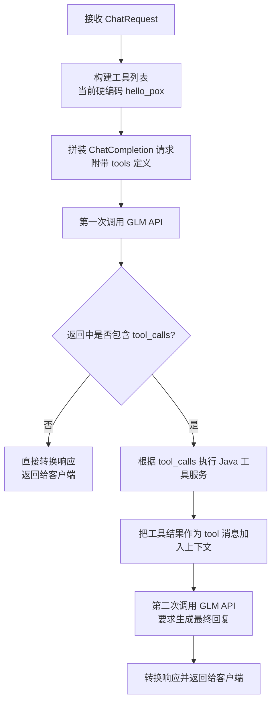
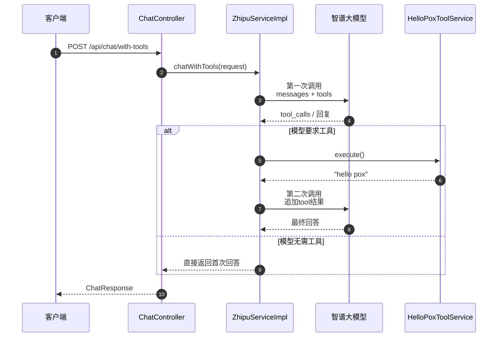

# 大模型工具调用详解

本指南面向刚接触大模型工具调用（Tool Calling）的同学，结合项目当前的 `HelloPox` 示例，详细说明从工具定义、调用判断、执行到结果回传的完整流程。阅读完毕后，你应该能够回答以下问题：

- 工具在系统中是如何被描述和持久化的？
- API 为什么会触发大模型的工具调用？
- 代码中是如何判断大模型是否需要工具，并如何把结果再交给大模型生成最终回答的？

---

## 1. 核心角色与术语

| 角色 | 说明 | 对应代码/表 |
| --- | --- | --- |
| 工具定义（Tool Definition） | 描述单个可调用工具的元数据，例如名称、描述、参数、HTTP 配置等 | `tool_definition` 表、`ToolDefinitionPO` |
| Agent-工具关联（Agent Tool） | 指定某个 Agent 可以使用哪些工具及优先级 | `agent_tool` 表、`AgentToolPO` |
| API 请求体（ChatRequest） | 前端或客户端发起的大模型对话请求，包含消息、模型、参数等 | `ChatRequest` |
| 工具实现（Tool Service） | 真正执行业务逻辑的 Java Service，例如 `HelloPoxToolService` | Spring Service |
| 工具调用流程（Chat With Tools） | 服务层封装的完整两阶段调用逻辑 | `ZhipuServiceImpl.chatWithTools` |

### 1.1 工具定义实体

工具的元数据结构体位于 `back/piteAgents/src/main/java/pox/com/piteagents/entity/po/ToolDefinitionPO.java`，与数据库表 `tool_definition` 一一对应：

```java
@TableName("tool_definition")
public class ToolDefinitionPO implements Serializable {
    @TableId(value = "id", type = IdType.AUTO)
    private Long id;
    @TableField("name")
    private String name;
    @TableField("description")
    private String description;
    @TableField("endpoint")
    private String endpoint;
    @TableField("method")
    private String method;
    @TableField("parameters")
    private String parameters;
    // ...
}
```

> 生产环境中，我们会从数据库加载这些定义并动态传给大模型；当前 POC 阶段使用硬编码的 `hello_pox` 工具，方便快速演示流程。

### 1.2 Agent-工具关联

`agent_tool` 关联表用于控制每个 Agent 拥有哪些工具、优先级和启用状态（见 `back/piteAgents/src/main/java/pox/com/piteagents/entity/po/AgentToolPO.java`）。后续接入更多工具时，就可以通过这张表管理不同 Agent 的工具包。

### 1.3 API 请求与消息体

`ChatRequest`（`back/piteAgents/src/main/java/pox/com/piteagents/entity/dto/request/ChatRequest.java`）定义了对话请求的结构：

```java
@NotEmpty
private List<Message> messages;
private String model;
private Double temperature;
private Integer maxTokens;
private Boolean stream;
private Double topP;
```

只要消息列表里出现诸如“请调用 hello_pox 工具”的字眼，大模型就有机会决定是否调用我们提供的工具。

---

## 2. 对外接口：`POST /api/chat/with-tools`

控制器位于 `back/piteAgents/src/main/java/pox/com/piteagents/controller/ChatController.java:135`。该接口专门用于测试工具调用：

```java
@PostMapping("/chat/with-tools")
public ApiResponse<ChatResponse> chatWithTools(@Valid @RequestBody ChatRequest request) {
    log.info("收到工具调用测试请求");
    ChatResponse response = zhipuService.chatWithTools(request);
    return ApiResponse.success(response);
}
```

### 2.1 示例请求（我们测试使用的示例）

```json
POST /api/chat/with-tools
Content-Type: application/json

{
  "messages": [
    {"role": "user", "content": "请调用 hello_pox 工具"}
  ],
  "model": "glm-4-5",
  "temperature": 0.3,
  "maxTokens": 1024
}
```

1. 客户端发送如上请求。
2. `ChatController` 直接调用服务层的 `chatWithTools`。
3. 服务层将流程分为两次与大模型的交互：第一次判断是否要用工具，第二次基于工具结果生成最终回答。

---

## 3. 两阶段工具调用流程

主逻辑集中在 `back/piteAgents/src/main/java/pox/com/piteagents/service/impl/ZhipuServiceImpl.java:261`。

### 3.1 流程图（Mermaid）



### 3.2 时序图（Mermaid）



---

## 4. 关键代码走读

### 4.1 定义工具并构建请求

在 `chatWithTools` 的开头，我们先硬编码一个工具定义（未来可改为从数据库加载）：

```java
ChatTool helloPoxTool = ChatTool.builder()
        .type("function")
        .function(ChatFunction.builder()
                .name("hello_pox")
                .description("返回问候语 hello pox")
                .parameters(ChatFunctionParameters.builder()
                        .type("object")
                        .build())
                .build())
        .build();
```

随后调用 `buildChatRequestWithTools`（见 `back/piteAgents/src/main/java/pox/com/piteagents/service/impl/ZhipuServiceImpl.java:385`）把工具列表塞进请求体：

```java
var builder = ChatCompletionCreateParams.builder()
        .model(model)
        .messages(messages)
        .tools(tools)   // 添加工具定义是关键
        .stream(false);
```

### 4.2 第一次模型调用：判断是否需要工具

```java
ChatCompletionResponse response1 = zhipuAiClient.chat().createChatCompletion(requestWithTools);
var choice = response1.getData().getChoices().get(0);
var message = choice.getMessage();
var toolCalls = message.getToolCalls();
```

此处的 `toolCalls` 就是大模型告诉我们“我需要哪些工具”的信号。只要列表非空，我们就去执行相应的工具服务。**为什么模型会调用？** 因为我们把工具列表传给它，并且用户问题（例如“请调用 hello_pox 工具”）触发了模型的工具选择逻辑，模型认为需要外部信息才回答得更好，于是返回 `tool_calls`。

### 4.3 执行工具并回填结果

```java
if ("hello_pox".equals(toolName)) {
    toolResult = helloPoxToolService.execute();
}

ChatMessage toolResultMessage = ChatMessage.builder()
        .role("tool")
        .content(toolResult)
        .toolCallId(toolCallId)
        .build();
messagesWithToolResult.add(toolResultMessage);
```

`HelloPoxToolService.execute()`（`back/piteAgents/src/main/java/pox/com/piteagents/service/HelloPoxToolService.java:27`）返回固定字符串 `"hello pox"`。随后我们把这个字符串包装成一条 `role = tool` 的消息，再次请求大模型。

### 4.4 第二次模型调用：生成最终回答

```java
ChatCompletionCreateParams request2 = ChatCompletionCreateParams.builder()
        .model(...)
        .messages(messagesWithToolResult)
        .temperature(...)
        .maxTokens(...)
        .build();
ChatCompletionResponse response2 = zhipuAiClient.chat().createChatCompletion(request2);
```

最终结果通过 `convertResponse`（`back/piteAgents/src/main/java/pox/com/piteagents/service/impl/ZhipuServiceImpl.java:471`）转成业务响应 `ChatResponse` 返回给客户端。

---

## 5. 我们实际测试的输入输出

1. **输入**：用户消息 `请调用 hello_pox 工具`。
2. **第一次模型响应**：`message.toolCalls` 包含 `hello_pox`，说明模型决定调用。
3. **工具执行**：`HelloPoxToolService` 返回 `"hello pox"`。
4. **第二次模型响应**：模型收到工具结果后，通常会生成类似“工具执行成功，返回：hello pox”的自然语言回答。

> 判断是否真的触发了工具，只需查看日志或调试时观察 `toolCalls` 是否为空即可。日志中会打印 `log.info("AI 请求调用工具，数量: {}", toolCalls.size());`，非常直观。

---

## 6. 常见问题解答

- **Q: 工具为什么会被调用？**  
  A: 因为我们把工具定义提供给大模型，当它判定生成答案需要外部信息（比如用户显式要求调用工具），就会在返回中附带 `tool_calls`。

- **Q: 代码里是怎么判断要不要调用工具的？**  
  A: 检查 `toolCalls != null && !toolCalls.isEmpty()`。如果成立，就根据 `toolCall.getFunction().getName()` 找到对应的工具实现。

- **Q: 如果有多个工具怎么办？**  
  A: `toolCalls` 可能包含多条。当前示例只取第一个，你可以扩展循环逐个执行，并把每个结果作为单独的 `tool` 消息附加到上下文中。

- **Q: 生产环境如何管理工具？**  
  A: 把工具元数据写入 `tool_definition` 表，通过 `ToolDefinitionMapper`（`back/piteAgents/src/main/resources/mapper/ToolDefinitionMapper.xml:25`）查询，再转换成 `ChatTool` 列表传给模型。同时用 `agent_tool` 表配置不同 Agent 的工具集合。

---

## 7. 下一步如何扩展

1. **接入真实工具**：把外部 API 调用封装在新的 Spring Service 中，返回 JSON 字符串或结构化数据。
2. **数据库驱动的工具列表**：编写加载逻辑，从 `ToolDefinitionPO` 和 `AgentToolPO` 构建 `ChatTool` 列表，而不是写死在代码里。
3. **完善异常处理**：当工具执行失败时，把错误信息通过 `tool` 消息回传，让模型决定如何向用户说明。
4. **增加单元测试**：覆盖“有工具调用”和“无工具调用”两种路径，确保逻辑稳定。

通过上述文档和示例，你已经掌握了项目中大模型工具调用的每个环节：工具如何定义、模型如何决定调用、服务层如何执行并再次请求模型生成最终回答。若需进一步调试，只需打断点或查看日志，即可快速定位每个步骤的具体行为。
