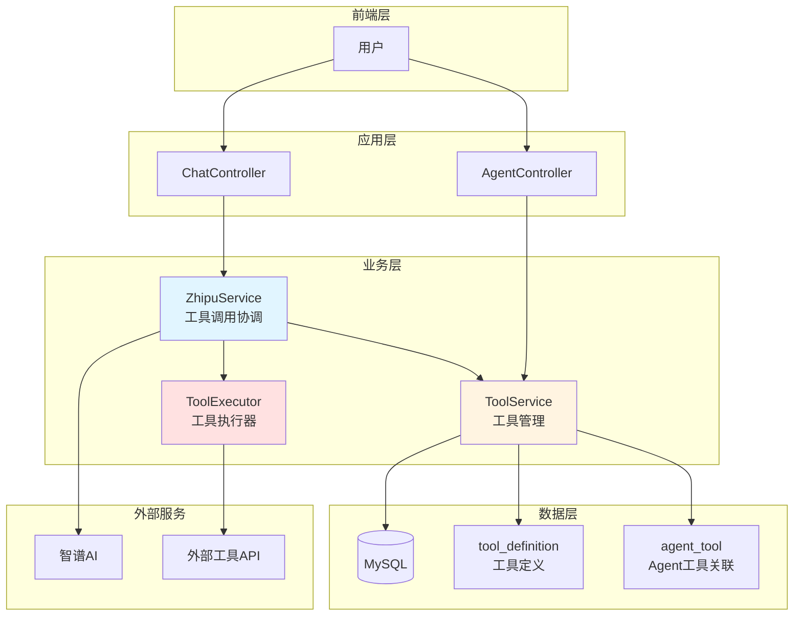
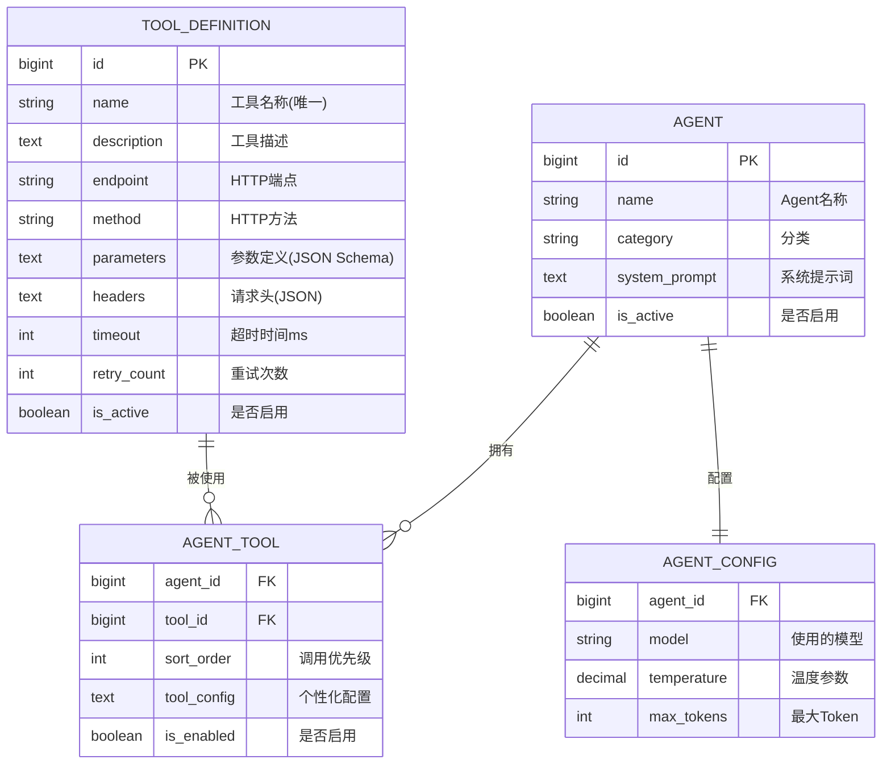
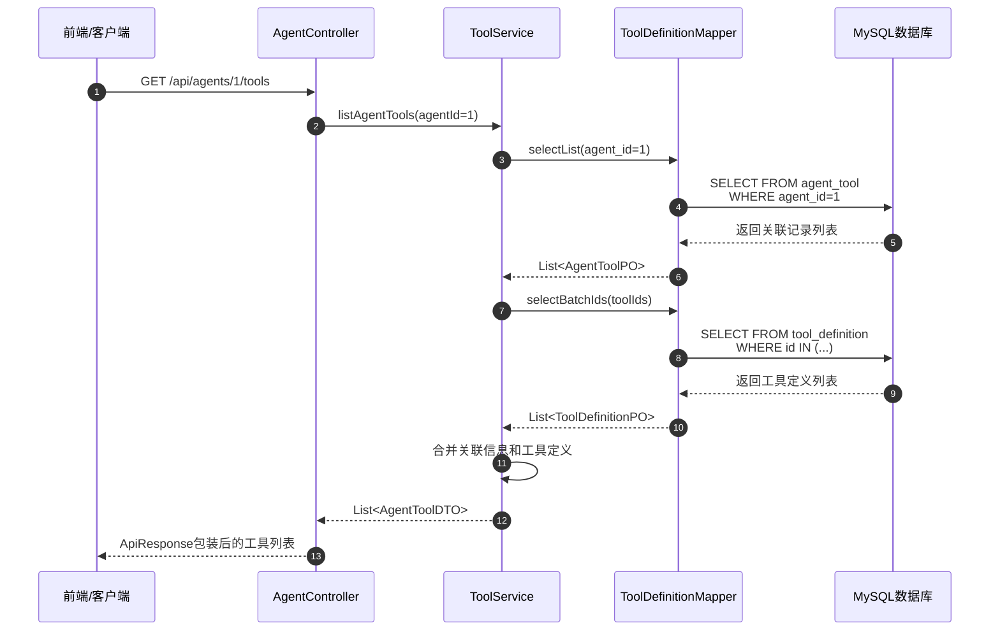
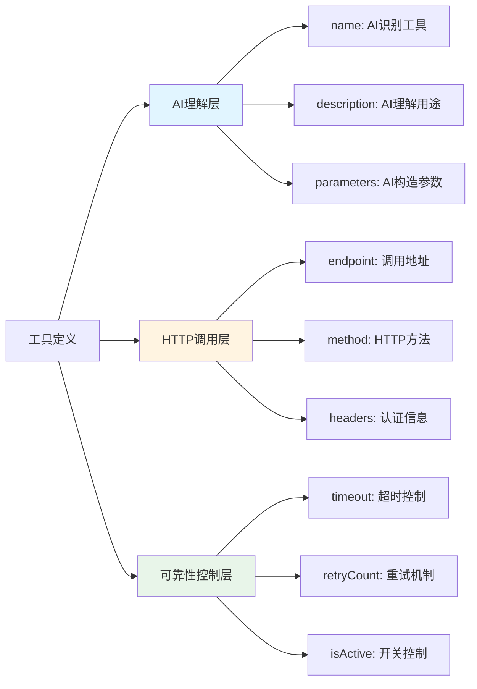
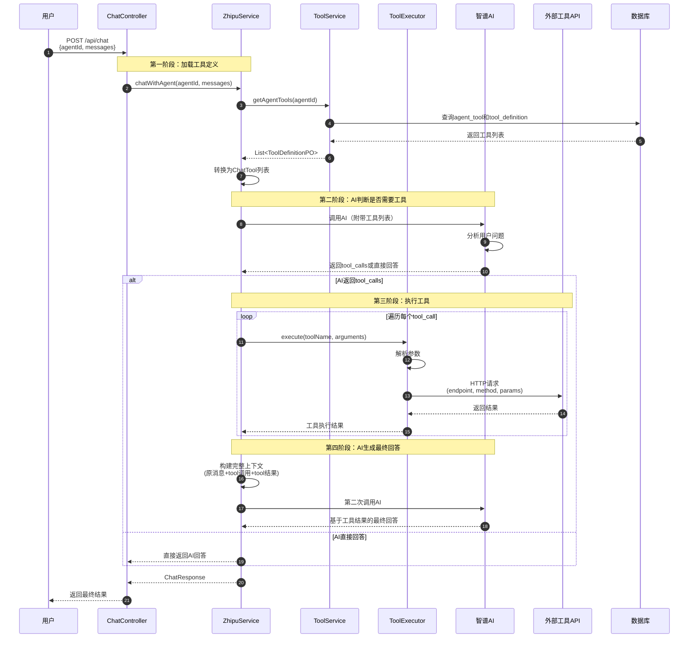
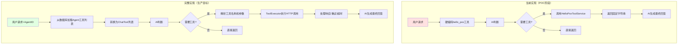
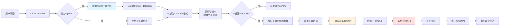
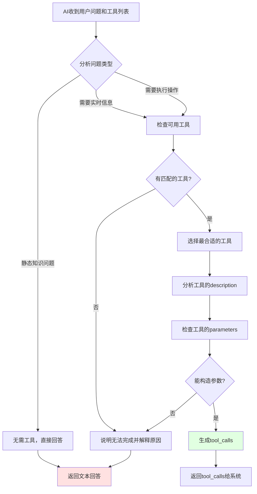
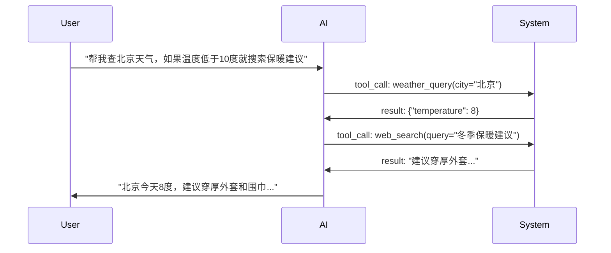

# 工具调用架构完整说明文档

> 本文档面向希望深入理解 piteAgents 工具调用机制的开发者，详细说明工具管理、Agent 工具关联、工具调用流程以及当前实现状态。

---

## 目录

1. [工具调用概述](#1-工具调用概述)
2. [数据库设计](#2-数据库设计)
3. [Agent 获取工具列表](#3-agent-获取工具列表)
4. [工具属性详解](#4-工具属性详解)
5. [工具调用流程](#5-工具调用流程)
6. [当前实现状态](#6-当前实现状态)
7. [完整实现方案](#7-完整实现方案)

---

## 1. 工具调用概述

### 1.1 什么是工具调用？

工具调用（Tool Calling / Function Calling）是大模型的一项核心能力，允许 AI 在对话过程中**主动调用外部工具或 API** 来获取实时信息、执行特定操作，从而生成更准确、更有价值的回答。

**典型场景：**
- 🔍 **搜索工具**：查询最新新闻、天气、股票价格
- 💻 **代码执行**：运行代码片段并返回结果
- 📊 **数据查询**：从数据库或 API 获取实时数据
- 🛠️ **业务操作**：创建订单、发送邮件、预约服务

### 1.2 系统架构概览



---

## 2. 数据库设计

### 2.1 ER 关系图



### 2.2 表结构说明

#### tool_definition（工具定义表）

存储可调用工具的元数据，定义了工具的基本信息和调用规范。

| 字段 | 类型 | 说明 | 示例 |
|------|------|------|------|
| `id` | BIGINT | 主键ID | 1 |
| `name` | VARCHAR(100) | 工具唯一名称 | `"web_search"` |
| `description` | TEXT | 工具功能描述 | `"搜索互联网上的相关信息"` |
| `endpoint` | VARCHAR(500) | HTTP API 地址 | `"https://api.search.com/query"` |
| `method` | VARCHAR(10) | HTTP 方法 | `"POST"` |
| `parameters` | TEXT | JSON Schema 参数定义 | `{"type":"object",...}` |
| `headers` | TEXT | HTTP 请求头（JSON） | `{"Authorization":"Bearer xxx"}` |
| `timeout` | INT | 超时时间（毫秒） | `30000` |
| `retry_count` | INT | 失败重试次数 | `3` |
| `is_active` | BOOLEAN | 是否启用 | `TRUE` |

#### agent_tool（Agent 工具关联表）

管理每个 Agent 可以使用哪些工具，以及调用的优先级和个性化配置。

| 字段 | 类型 | 说明 | 示例 |
|------|------|------|------|
| `agent_id` | BIGINT | Agent ID（联合主键） | 1 |
| `tool_id` | BIGINT | 工具ID（联合主键） | 5 |
| `sort_order` | INT | 调用优先级（越小越优先） | 0 |
| `tool_config` | TEXT | 个性化配置（JSON） | `{"max_results": 10}` |
| `is_enabled` | BOOLEAN | 是否启用 | `TRUE` |

---

## 3. Agent 获取工具列表

### 3.1 API 接口

**获取 Agent 的工具列表：**

```http
GET /api/agents/{agentId}/tools
```

**响应示例：**

```json
{
  "code": 200,
  "message": "success",
  "data": [
    {
      "toolId": 1,
      "name": "web_search",
      "description": "搜索互联网上的相关信息",
      "endpoint": "https://api.search.com/query",
      "method": "POST",
      "parameters": {
        "type": "object",
        "properties": {
          "query": {
            "type": "string",
            "description": "搜索关键词"
          }
        },
        "required": ["query"]
      },
      "headers": null,
      "sortOrder": 0,
      "enabled": true
    }
  ]
}
```

### 3.2 实现流程



### 3.3 代码实现

**控制器层** (`AgentController.java:171`)

```java
@GetMapping("/{agentId}/tools")
public ApiResponse<List<AgentToolDTO>> listAgentTools(@PathVariable Long agentId) {
    log.info("查询 Agent 工具列表，agentId: {}", agentId);
    List<AgentToolDTO> tools = toolService.listAgentTools(agentId);
    return ApiResponse.success(tools);
}
```

**服务层** (`ToolServiceImpl.java:262`)

```java
@Override
@Transactional(readOnly = true)
public List<AgentToolDTO> listAgentTools(Long agentId) {
    // 1. 查询 Agent-工具关联关系
    List<AgentToolPO> relations = agentToolMapper.selectList(
        Wrappers.<AgentToolPO>lambdaQuery()
            .eq(AgentToolPO::getAgentId, agentId)
            .orderByAsc(AgentToolPO::getSortOrder)  // 按优先级排序
    );
    
    // 2. 批量查询工具定义
    Set<Long> toolIds = relations.stream()
        .map(AgentToolPO::getToolId)
        .collect(Collectors.toSet());
    List<ToolDefinitionPO> tools = toolDefinitionMapper.selectBatchIds(toolIds);
    
    // 3. 合并关联信息和工具定义
    return relations.stream()
        .map(relation -> {
            ToolDefinitionPO tool = toolMap.get(relation.getToolId());
            return AgentToolDTO.builder()
                .toolId(tool.getId())
                .name(tool.getName())
                .description(tool.getDescription())
                .endpoint(tool.getEndpoint())
                .method(tool.getMethod())
                .parameters(fromJsonToObjectMap(tool.getParameters()))
                .sortOrder(relation.getSortOrder())  // 来自关联表
                .enabled(relation.getIsEnabled())    // 来自关联表
                .build();
        })
        .collect(Collectors.toList());
}
```

**Mapper 层** (`ToolDefinitionMapper.xml:36`)

```xml
<select id="selectToolsByAgentId" resultMap="BaseResultMap">
    SELECT t.*
    FROM tool_definition t
    INNER JOIN agent_tool at ON t.id = at.tool_id
    WHERE at.agent_id = #{agentId}
      AND at.is_enabled = TRUE
      AND t.is_active = TRUE
    ORDER BY at.sort_order ASC
</select>
```

### 3.4 当前支持的功能

✅ **已实现：**
- 工具的 CRUD 管理（创建、查询、更新、删除）
- Agent 与工具的关联（绑定、解绑、查询）
- 工具列表按优先级排序
- 工具启用/禁用控制
- 个性化工具配置

❌ **未实现：**
- Agent 对话时自动加载其工具列表
- 动态工具执行器（调用真实 HTTP endpoint）
- 工具调用日志记录
- 工具调用失败的重试机制
- 多工具并发调用

---

## 4. 工具属性详解

### 4.1 为什么需要这些属性？

工具定义包含了完整的 HTTP API 调用所需的所有信息，每个属性都有其特定用途：



### 4.2 属性详细说明

#### 4.2.1 AI 理解层属性

这些属性用于让 AI 理解和智能选择工具。

| 属性 | 类型 | 必填 | 作用 | 示例 |
|------|------|------|------|------|
| **name** | String | ✅ | 工具唯一标识符，AI 通过此名称识别工具 | `"web_search"`, `"code_executor"` |
| **description** | String | ✅ | 工具功能描述，**帮助 AI 理解何时调用此工具** | `"当用户需要查询最新信息时，使用此工具搜索互联网"` |
| **parameters** | JSON Schema | ⚠️ | 定义工具输入参数的结构，**AI 根据此定义构造调用参数** | 见下方详解 |

**parameters 示例：**

```json
{
  "type": "object",
  "properties": {
    "query": {
      "type": "string",
      "description": "搜索关键词"
    },
    "limit": {
      "type": "integer",
      "description": "返回结果数量",
      "default": 10
    }
  },
  "required": ["query"]
}
```

**AI 如何使用 parameters？**

1. AI 读取 `properties` 了解需要哪些参数
2. AI 根据用户问题提取相关信息
3. AI 构造符合 schema 的参数 JSON
4. 系统收到 AI 的调用请求后，使用这些参数调用实际 API

#### 4.2.2 HTTP 调用层属性

这些属性用于实际执行 HTTP 请求。

| 属性 | 类型 | 必填 | 作用 | 示例 |
|------|------|------|------|------|
| **endpoint** | String | ✅ | 工具的 HTTP API 地址 | `"https://api.weather.com/v1/query"` |
| **method** | String | ✅ | HTTP 请求方法 | `"POST"`, `"GET"`, `"PUT"` |
| **headers** | JSON | ⚠️ | HTTP 请求头，如认证信息、Content-Type | `{"Authorization": "Bearer xxx"}` |

**headers 使用场景：**

```json
{
  "Content-Type": "application/json",
  "Authorization": "Bearer sk-xxx",
  "X-Custom-Header": "custom-value"
}
```

#### 4.2.3 可靠性控制层属性

这些属性用于提高工具调用的可靠性和可控性。

| 属性 | 类型 | 默认值 | 作用 | 建议值 |
|------|------|--------|------|--------|
| **timeout** | Integer | 30000 | 调用超时时间（毫秒），防止长时间等待 | 10000-60000 |
| **retryCount** | Integer | 3 | 失败后的重试次数，提高成功率 | 1-5 |
| **isActive** | Boolean | true | 全局启用开关，快速禁用问题工具 | true/false |

**为什么需要 timeout？**

```java
// 场景：外部API响应慢或网络故障
try {
    HttpResponse response = httpClient.execute(request, timeout);
} catch (TimeoutException e) {
    // 超时后可以重试或返回错误，避免用户长时间等待
}
```

**为什么需要 retryCount？**

```java
// 场景：网络抖动或临时故障
int attempts = 0;
while (attempts < retryCount) {
    try {
        return callExternalAPI();
    } catch (IOException e) {
        attempts++;
        if (attempts >= retryCount) throw e;
        Thread.sleep(1000 * attempts); // 指数退避
    }
}
```

### 4.3 属性必要性总结

| 属性 | 必要性 | 理由 |
|------|--------|------|
| name | ⭐⭐⭐⭐⭐ | 工具唯一标识，缺少无法识别 |
| description | ⭐⭐⭐⭐⭐ | AI 智能选择的关键，缺少会导致误调用 |
| endpoint | ⭐⭐⭐⭐⭐ | 实际调用地址，缺少无法执行 |
| method | ⭐⭐⭐⭐⭐ | HTTP 方法必需 |
| parameters | ⭐⭐⭐⭐ | 有参数的工具必需，无参工具可省略 |
| headers | ⭐⭐⭐ | 需要认证的 API 必需 |
| timeout | ⭐⭐⭐ | 防止超时，建议保留 |
| retryCount | ⭐⭐ | 提高可靠性，可选 |
| isActive | ⭐⭐⭐ | 运维控制开关，建议保留 |

**结论：** 这些属性都有实际用途，不是冗余设计。在生产环境中，完整的HTTP工具调用需要这些配置来保证功能完整性和可靠性。

---

## 5. 工具调用流程

### 5.1 完整调用流程图



### 5.2 关键代码示例

#### 步骤1：从数据库加载 Agent 的工具列表

```java
// 当前：硬编码（POC阶段）
ChatTool helloPoxTool = ChatTool.builder()
    .type("function")
    .function(ChatFunction.builder()
        .name("hello_pox")
        .description("返回问候语")
        .parameters(ChatFunctionParameters.builder().type("object").build())
        .build())
    .build();

// 未来：从数据库动态加载
List<ToolDefinitionPO> toolDefs = toolMapper.selectToolsByAgentId(agentId);
List<ChatTool> tools = toolDefs.stream()
    .map(this::convertToChatTool)
    .collect(Collectors.toList());
```

#### 步骤2：第一次调用 AI，附带工具列表

```java
ChatCompletionCreateParams request = ChatCompletionCreateParams.builder()
    .model("glm-4.5")
    .messages(messages)
    .tools(tools)  // 关键：把工具列表传给AI
    .build();

ChatCompletionResponse response = zhipuAiClient.chat().createChatCompletion(request);
```

#### 步骤3：检查 AI 是否返回 tool_calls

```java
var message = response.getData().getChoices().get(0).getMessage();
var toolCalls = message.getToolCalls();

if (toolCalls != null && !toolCalls.isEmpty()) {
    // AI 决定调用工具
    for (var toolCall : toolCalls) {
        String toolName = toolCall.getFunction().getName();
        String arguments = toolCall.getFunction().getArguments();
        String toolCallId = toolCall.getId();
        
        // 执行工具...
    }
}
```

#### 步骤4：执行工具并获取结果

```java
// 当前：硬编码工具实现
if ("hello_pox".equals(toolName)) {
    toolResult = helloPoxToolService.execute();
}

// 未来：通用HTTP工具执行器
ToolDefinitionPO toolDef = toolMapper.selectByName(toolName);
String result = toolExecutor.execute(
    toolDef.getEndpoint(),
    toolDef.getMethod(),
    arguments,  // AI生成的参数JSON
    toolDef.getHeaders(),
    toolDef.getTimeout()
);
```

#### 步骤5：构建包含工具结果的上下文

```java
List<ChatMessage> messagesWithToolResult = new ArrayList<>();
messagesWithToolResult.addAll(originalMessages);  // 原始对话
messagesWithToolResult.add(message);  // AI的tool_call请求

// 添加工具执行结果
ChatMessage toolResultMessage = ChatMessage.builder()
    .role("tool")
    .content(toolResult)
    .toolCallId(toolCallId)  // 必须匹配AI的调用ID
    .build();
messagesWithToolResult.add(toolResultMessage);
```

#### 步骤6：第二次调用 AI 生成最终回答

```java
ChatCompletionCreateParams request2 = ChatCompletionCreateParams.builder()
    .model("glm-4.5")
    .messages(messagesWithToolResult)  // 包含工具结果的完整上下文
    .build();

ChatCompletionResponse finalResponse = zhipuAiClient.chat().createChatCompletion(request2);
```

---

## 6. 当前实现状态

### 6.1 已实现功能 ✅

#### 工具管理模块

| 功能 | API | 状态 | 文件 |
|------|-----|------|------|
| 创建工具 | `POST /api/tools` | ✅ | ToolController.java:33 |
| 查询工具列表 | `GET /api/tools` | ✅ | ToolController.java:76 |
| 查询工具详情 | `GET /api/tools/{id}` | ✅ | ToolController.java:93 |
| 更新工具 | `PUT /api/tools/{id}` | ✅ | ToolController.java:47 |
| 删除工具 | `DELETE /api/tools/{id}` | ✅ | ToolController.java:61 |

#### Agent 工具关联

| 功能 | API | 状态 | 文件 |
|------|-----|------|------|
| 绑定工具到 Agent | `POST /api/agents/{agentId}/tools` | ✅ | AgentController.java:157 |
| 查询 Agent 的工具 | `GET /api/agents/{agentId}/tools` | ✅ | AgentController.java:171 |

#### 基础工具调用

| 功能 | API | 状态 | 文件 |
|------|-----|------|------|
| 工具调用测试接口 | `POST /api/chat/with-tools` | ✅ | ChatController.java:134 |
| HelloPox 示例工具 | - | ✅ | HelloPoxToolService.java |

### 6.2 未实现功能 ❌

| 功能 | 状态 | 说明 |
|------|------|------|
| Agent 对话时动态加载工具 | ❌ | 当前工具硬编码，未集成到 Agent 对话流程 |
| HTTP 工具执行器 | ❌ | 缺少通用的 HTTP 客户端调用逻辑 |
| 工具参数验证 | ❌ | 未验证 AI 生成的参数是否符合 JSON Schema |
| 工具调用日志 | ❌ | 未记录工具调用的详细日志 |
| 工具调用重试机制 | ❌ | 未实现失败重试逻辑 |
| 多工具并发调用 | ❌ | 当前只处理第一个 tool_call |
| 工具调用超时控制 | ❌ | 未使用 timeout 属性 |
| 工具鉴权 | ❌ | 未使用 headers 中的认证信息 |

### 6.3 当前流程 vs 完整流程对比



---

## 7. 完整实现方案

### 7.1 缺失组件：ToolExecutor（工具执行器）

工具执行器负责根据工具定义调用实际的 HTTP API。

**实现位置：** `service/ToolExecutor.java`（待创建）

**核心职责：**
1. 根据工具定义构建 HTTP 请求
2. 执行 HTTP 调用
3. 处理超时和重试
4. 解析响应并返回结果
5. 记录调用日志

**伪代码：**

```java
@Service
public class ToolExecutor {
    
    public String execute(ToolDefinitionPO tool, String argumentsJson) {
        // 1. 解析参数
        Map<String, Object> params = parseArguments(argumentsJson);
        
        // 2. 构建HTTP请求
        HttpRequest request = buildHttpRequest(
            tool.getEndpoint(),
            tool.getMethod(),
            params,
            parseHeaders(tool.getHeaders())
        );
        
        // 3. 执行请求（带超时和重试）
        int attempts = 0;
        while (attempts < tool.getRetryCount()) {
            try {
                HttpResponse response = httpClient.execute(
                    request, 
                    tool.getTimeout()
                );
                return response.body();
            } catch (Exception e) {
                attempts++;
                if (attempts >= tool.getRetryCount()) {
                    throw new ToolExecutionException("工具调用失败", e);
                }
                Thread.sleep(calculateBackoff(attempts));
            }
        }
    }
}
```

### 7.2 集成到 Agent 对话流程

**需要修改的方法：** `ZhipuServiceImpl.chatWithTools()`

**改造方案：**

```java
@Override
public ChatResponse chatWithTools(ChatRequest request, Long agentId) {
    // 1. 从数据库加载 Agent 的工具列表（替换硬编码）
    List<ToolDefinitionPO> toolDefs = toolMapper.selectToolsByAgentId(agentId);
    List<ChatTool> tools = toolDefs.stream()
        .map(this::convertToChatTool)
        .collect(Collectors.toList());
    
    // 2. 构建请求并调用 AI
    ChatCompletionCreateParams requestWithTools = buildChatRequestWithTools(request, tools);
    ChatCompletionResponse response1 = zhipuAiClient.chat().createChatCompletion(requestWithTools);
    
    // 3. 检查是否有工具调用
    var toolCalls = response1.getData().getChoices().get(0).getMessage().getToolCalls();
    
    if (toolCalls != null && !toolCalls.isEmpty()) {
        // 4. 执行所有工具调用（支持多工具）
        List<ChatMessage> toolResults = new ArrayList<>();
        for (var toolCall : toolCalls) {
            String toolName = toolCall.getFunction().getName();
            String arguments = toolCall.getFunction().getArguments();
            
            // 查找工具定义
            ToolDefinitionPO toolDef = toolDefs.stream()
                .filter(t -> t.getName().equals(toolName))
                .findFirst()
                .orElseThrow(() -> new Exception("未知工具: " + toolName));
            
            // 使用 ToolExecutor 执行工具
            String result = toolExecutor.execute(toolDef, arguments);
            
            // 构建工具结果消息
            toolResults.add(ChatMessage.builder()
                .role("tool")
                .content(result)
                .toolCallId(toolCall.getId())
                .build());
        }
        
        // 5. 第二次调用 AI，基于工具结果生成回答
        // ...
    }
    
    return convertResponse(response2);
}
```

### 7.3 数据流图



---

## 8. 工具定义示例

### 8.1 搜索工具示例

```json
{
  "name": "web_search",
  "description": "当用户需要查询最新信息、实时数据或互联网上的内容时，使用此工具搜索。例如：最新新闻、天气、股票价格等。",
  "endpoint": "https://api.search.com/v1/query",
  "method": "POST",
  "parameters": {
    "type": "object",
    "properties": {
      "query": {
        "type": "string",
        "description": "搜索关键词"
      },
      "limit": {
        "type": "integer",
        "description": "返回结果数量",
        "default": 5,
        "minimum": 1,
        "maximum": 10
      }
    },
    "required": ["query"]
  },
  "headers": {
    "Authorization": "Bearer sk-xxx",
    "Content-Type": "application/json"
  },
  "timeout": 10000,
  "retryCount": 2,
  "isActive": true
}
```

### 8.2 代码执行工具示例

```json
{
  "name": "code_executor",
  "description": "执行 Python 代码并返回结果。适用于需要计算、数据处理或算法演示的场景。",
  "endpoint": "https://api.coderun.com/v1/execute",
  "method": "POST",
  "parameters": {
    "type": "object",
    "properties": {
      "code": {
        "type": "string",
        "description": "要执行的 Python 代码"
      },
      "timeout": {
        "type": "integer",
        "description": "执行超时时间（秒）",
        "default": 5,
        "maximum": 30
      }
    },
    "required": ["code"]
  },
  "headers": {
    "X-API-Key": "your-api-key"
  },
  "timeout": 35000,
  "retryCount": 1,
  "isActive": true
}
```

### 8.3 天气查询工具示例

```json
{
  "name": "weather_query",
  "description": "查询指定城市的实时天气信息，包括温度、湿度、天气状况等。",
  "endpoint": "https://api.weather.com/v1/current",
  "method": "GET",
  "parameters": {
    "type": "object",
    "properties": {
      "city": {
        "type": "string",
        "description": "城市名称，如：北京、上海、深圳"
      },
      "unit": {
        "type": "string",
        "description": "温度单位",
        "enum": ["celsius", "fahrenheit"],
        "default": "celsius"
      }
    },
    "required": ["city"]
  },
  "headers": {
    "X-Weather-API-Key": "your-weather-api-key"
  },
  "timeout": 5000,
  "retryCount": 3,
  "isActive": true
}
```

---

## 9. AI 如何决定调用工具？

### 9.1 决策过程



### 9.2 决策依据

AI 主要根据以下信息决定是否调用工具：

1. **工具描述 (description)** - 80% 权重
   - 描述越详细，AI 匹配越准确
   - 应包含：功能说明、适用场景、典型用例

2. **工具参数 (parameters)** - 15% 权重
   - AI 检查是否能从用户问题中提取参数
   - 必需参数缺失时可能不调用

3. **用户问题语义** - 5% 权重
   - 显式要求（"请搜索..."）
   - 隐式需求（"最新的股票价格"）

### 9.3 优化工具描述的技巧

**❌ 不好的描述：**
```json
{
  "name": "search",
  "description": "搜索工具"
}
```

**✅ 好的描述：**
```json
{
  "name": "web_search",
  "description": "当用户询问需要实时信息、最新数据或互联网上的内容时使用此工具。适用场景包括：1) 最新新闻和事件 2) 实时天气和股价 3) 网页内容查询 4) 不在模型训练数据中的信息。请使用简洁明确的搜索关键词。"
}
```

---

## 10. 完整实现 Checklist

### 10.1 核心组件

- [x] 工具定义表 `tool_definition`
- [x] Agent 工具关联表 `agent_tool`
- [x] 工具管理 Service (`ToolServiceImpl`)
- [x] 工具管理 Controller (`ToolController`)
- [x] Agent 工具关联 API
- [x] 基础工具调用流程 (`chatWithTools`)
- [ ] HTTP 工具执行器 (`ToolExecutor`)
- [ ] 工具参数验证器 (`ToolParameterValidator`)
- [ ] 工具调用日志表 `tool_call_log`

### 10.2 Agent 对话集成

- [ ] 修改 `ChatController`，支持 `agentId` 参数
- [ ] 在 `chatWithTools` 中动态加载 Agent 工具列表
- [ ] 替换硬编码的 `hello_pox` 为数据库驱动的工具
- [ ] 实现工具执行器调用真实 HTTP endpoint
- [ ] 支持多工具并发调用
- [ ] 记录工具调用日志

### 10.3 可靠性增强

- [ ] 实现工具调用超时控制
- [ ] 实现工具调用重试机制（指数退避）
- [ ] 实现工具调用熔断机制
- [ ] 工具调用结果缓存
- [ ] 工具调用监控和告警

---

## 11. 实际调用示例

### 11.1 用户视角

**对话示例：**

```
用户：北京今天天气怎么样？

系统内部流程：
1. 识别 Agent ID = 1（通用助手）
2. 加载 Agent 的工具列表 -> [web_search, weather_query]
3. 调用 AI，附带工具列表
4. AI 返回：tool_calls = [{"name": "weather_query", "arguments": {"city": "北京"}}]
5. ToolExecutor 执行：GET https://api.weather.com/v1/current?city=北京
6. 工具返回：{"temperature": 15, "condition": "晴朗"}
7. 再次调用 AI，传入工具结果
8. AI 生成最终回答："北京今天天气晴朗，温度约15°C，适合外出活动。"

系统返回：北京今天天气晴朗，温度约15°C，适合外出活动。
```

### 11.2 开发者视角

**调用流程日志：**

```
[INFO] 收到对话请求，agentId=1, message="北京今天天气怎么样？"
[INFO] 加载 Agent 工具列表...
[INFO] 查询到 2 个工具: [web_search, weather_query]
[INFO] 转换工具定义为 ChatTool 格式
[INFO] 第一次调用 AI，附带 2 个工具定义
[INFO] AI 返回 1 个 tool_call: weather_query(city=北京)
[INFO] 执行工具调用...
[INFO] HTTP请求: GET https://api.weather.com/v1/current?city=北京
[INFO] 工具执行成功，耗时: 245ms
[INFO] 工具返回结果: {"temperature":15,"condition":"晴朗"}
[INFO] 构建包含工具结果的上下文
[INFO] 第二次调用 AI，生成最终回答
[INFO] 对话完成，总耗时: 1.2s
```

---

## 12. 进阶话题

### 12.1 工具链（Tool Chaining）

AI 可以连续调用多个工具：



### 12.2 工具组合（Tool Composition）

多个工具并行调用：

```json
{
  "tool_calls": [
    {"name": "weather_query", "arguments": {"city": "北京"}},
    {"name": "weather_query", "arguments": {"city": "上海"}},
    {"name": "weather_query", "arguments": {"city": "深圳"}}
  ]
}
```

### 12.3 工具调用安全

**潜在风险：**
1. AI 构造恶意参数（SQL注入、命令注入）
2. 工具调用频率过高（DoS）
3. 敏感数据泄露

**防护措施：**
1. 参数严格验证（JSON Schema 校验）
2. 工具调用频率限制
3. 工具结果脱敏处理
4. 工具调用审计日志

---

## 13. 总结

### 13.1 当前状态

**工具管理：** ✅ 完整实现
- 工具的 CRUD
- Agent 工具关联
- 工具列表查询

**工具调用：** ⚠️ 部分实现
- 基础调用流程（硬编码工具）
- 两阶段调用机制
- 缺少 HTTP 执行器
- 未集成到 Agent 对话

### 13.2 关键问题回答

**Q1: Agent 如何获取工具列表？**

通过 `GET /api/agents/{agentId}/tools` 接口查询，底层使用 `ToolDefinitionMapper.selectToolsByAgentId()` 从数据库加载工具定义和关联配置。

**Q2: 当前是否支持工具调用？**

部分支持：
- ✅ 工具管理完整
- ✅ 基础调用流程（测试接口）
- ❌ Agent 对话未集成
- ❌ 缺少 HTTP 执行器

**Q3: 工具属性是否必需？**

是的，每个属性都有实际用途：
- **AI 层**：name, description, parameters（让 AI 理解和选择工具）
- **调用层**：endpoint, method, headers（执行 HTTP 请求）
- **可靠性层**：timeout, retryCount, isActive（保证稳定性）

### 13.3 下一步行动

**优先级 P0（核心功能）：**
1. 实现 `ToolExecutor` 通用 HTTP 执行器
2. 修改 `chatWithTools` 支持从数据库加载工具
3. 集成到 Agent 对话流程

**优先级 P1（增强功能）：**
1. 工具参数验证
2. 工具调用日志
3. 重试和超时机制

**优先级 P2（高级功能）：**
1. 工具调用缓存
2. 工具链支持
3. 工具调用监控

---

**文档版本**: 1.0.0  
**最后更新**: 2025-10-25  
**维护者**: piteAgents Team

